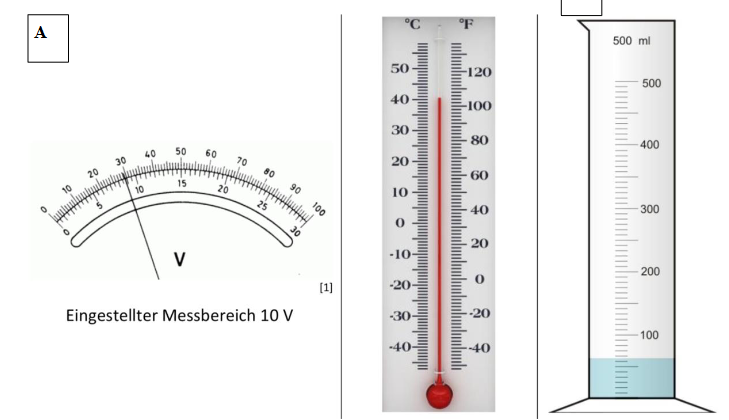

```{r setup, include=FALSE}
knitr::opts_chunk$set(echo = TRUE)
```

# Aufgabe 1
**Die Periodendauer eines Pendels wird gemessen. Ihr Wert wird mit $(10,0 \pm 0,1)s$ angegeben. Wie groß ist die relative Messunsicherheit?**

\begin{equation}\label{eq:uRel}
  \begin{split}
    u_{rel} &= \frac{u_x}{x} \\
    \Rightarrow \vert\frac{\pm0,1s}{10,0s}\vert & = 0,01 = 1\%.
  \end{split}
\end{equation}

\begin{itemize}
  \item  $u_{rel}$: Relative Messunsicherheit
  \item  $u_x$: Absolute Messunsicherheit
  \item  $x$: Bestwert
\end{itemize}

# Aufgabe 2:
**Es wurde eine Geschwindigkeit von $6 \frac{km}{h}$ mit einer relativen Unsicherheit von $1 \%$ gemessen. Wie groß ist die absolute Messunsicherheit?**

Aus Gleichung \ref{eq:uRel} folgt durch Umstellen:
\begin{equation}\label{eq:uAbs}
  \begin{split}
            u_x &= u_{rel}*x \\
    \Rightarrow & = \pm 0,01 * 6 \frac{km}{h}\\
                &= \pm 0,06 \frac{km}{h}.\\
  \end{split}
\end{equation}

# Aufgabe 3
**Ein analoger Spannungsmesser hat die Güteklasse 2 (d.h. die Messunsicherheit beträgt $2 \%$ des Messbereichs-Endwertes). Wie groß ist die relative Messunsicherheit der Anzeige, wenn im $10 V$-Messbereich $2,00 V$ abgelesen werden?**

Das Gerät entspricht der Güteklasse 2. Daraus folgt, dass die Messunsicherheit bei einem Vollausschlag
von $10 V$ bei $\pm0,2 V$ liegt. Mit Gleichung\ref{eq:uRel} ergibt sich:

\begin{center}
$\vert\frac{\pm 0,2V}{2V}\vert = 0,01 = 1\%$.
\end{center}

# Aufgabe 4:
**Sie wiegen in der Küche mit einer digitalen elektronischen Waage dessen kleinste Schrittweite (auch Auflösung genannt) $0,1 g$ beträgt einen Apfel. Der Apfel wiegt laut Anzeige $120,0 g$. Wie groß ist die
gesamte Messunsicherheit der Messung, wenn der Gerätehersteller eine Gerätemessunsicherheit von $1\%$ v. Messwert + $2 [dgt.]$ angibt?**

Berechnung der Skalenungenauigkeit $u_{Skala}$. Der tatsächliche Wert kann zwischen $119,95g$ und $120,05g$ liegen ($\rightarrow a=0,1g$). Daraus folgt für $u_{Skala}$ (digitale Waage):

\begin{equation}\label{eq:uDigit}
  \begin{split}
    u_{Skala} &= \frac{a}{2\sqrt{3}}\\
    \Rightarrow &= \frac{0,1g}{2\sqrt{3}}\\
              &= \pm 0,058g.
  \end{split}
\end{equation}

\begin{itemize}
  \item $u_{Skala}$: Messunsicherheit Skala
  \item $a$: Fehlerintervall
\end{itemize}

Aus der Aufgabenstellung folgt für die Messungenauigkeit der Waage $u_{Gerät}$:
\begin{center}
  $u_{Gerät} = 0,01 * 120g + 2 [dgt.] = \pm 1,4g.$
\end{center}

Die Gesamtunsicherheit berechnet sich dann als:
\begin{equation}\label{eq:uGes}
  \begin{split}
    u_{Gesamt} &= \sqrt{u_{Skala}^2+u_{Gerät}^2}\\
    \Rightarrow &= \sqrt{(\pm0,058g)^2\pm(1,4g)^2}\\
              &= \pm 1,4g.
  \end{split}
\end{equation}

# Aufgabe 5:
**Eine Spannung wurde gleichzeitig mit zwei baugleichen Analog-Multimetern (AMM) genau einmal gemessen: Messbereich: $200 mV$, Garantiefehlergrenze: $\pm (0,5\% v. Messwert. + 0,1\% v. Messbereich)$; Messwert 1 (AMM1): $22,0 mV$, Messwert 2 (AMM2): $22,5 mV$ ($\rightarrow a=0,1g$). Geben Sie die beiden Messergebnisse zusammen mit der Standardmessunsicherheit in korrekter Schreibweise an.**

AMM1:

Fehler $0,5\%$ vom Messwert: $u_{Messwert} = 0,005 * 22,0mV = \pm0,11mV$.

Fehler $0,1\%$ vom Messbereich: $u_{Messbereich} = 0,001 * 200mV = \pm0,20mV$.

Fehler der analogen Skala: $u_{Skala} = \frac{a}{2\sqrt{6}} = \frac{0,1mV}{2\sqrt{6}}=\pm0,020mV$.

Gesamtfehler errechnet sich als: 
\begin{equation}\label{eq:uGesSMM}
  \begin{split}
u_{Gesamt} &= \sqrt{u_{Skala}^2+u_{Messwert}^2+u_{Messbereich}^2}\\
          &= \sqrt{(\pm 0,020)^2+(\pm 0,11)^2+(\pm0,20)^2}mV\\
          &= \pm 0,23mV
\end{split}
\end{equation}

Gerätunsicherheit: $u_{AMM1} = \sqrt{u_{Messwert}^2+u_{Messbereich}^2} = \pm0,23 mV$.

AMM2:

Fehler $0,5\%$ vom Messwert: $u_{Messwert} = 0,005 * 22,5mV \approx \pm 0,11mV$.

Fehler $0,1\%$ vom Messbereich: $u_{Messbereich} = 0,001 * 200mV = \pm0,20mV$.

Fehler der analogen Skala: $u_{Skala} = \frac{a}{2\sqrt{6}} = \frac{0,1mV}{2\sqrt{6}}=\pm0,020mV$.

Gesamtfehler errechnet sich als analog zu Gleichung \ref{eq:uGesSMM}: 
\begin{align*}
  \begin{split}
u_{Gesamt}&= \sqrt{(\pm 0,020)^2+(\pm 0,11)^2+(\pm0,20)^2}mV\\
          &= \pm 0,23mV
\end{split}
\end{align*}

Gerätunsicherheit: $u_{AMM2} = \sqrt{u_{Messwert}^2+u_{Messbereich}^2} = \pm0,23 mV$.

# Aufgabe 6:
**Nehmen Sie nun an, Sie ändern den Messbereich des Multimeters und damit die Garantiefehlergrenze des Multimeters auf $\pm(0,2\% v. Messwert. + 0,02\% vom Messbereich)$ für den Messbereich von $2 V$. Es wird erneut gemessen - neuer Wert: $20 mV$ (wobei im $2V$ Messbereich, die kleinste ablesebare Skalenstrich ist $10mV$). Ändert sich die Messunsicherheit des Messgerätes? Wie ändert sich die Messunsicherheit der Ableseskala?**

Fehler $0,2\%$ vom Messwert: $u_{Messwert} = 0,002 * 20mV = \pm 0,04mV$.

Fehler $0,02\%$ vom Messbereich: $u_{Messbereich} = 0,0002 * 2000mV = \pm0,4mV$.

Fehler der analogen Skala: $u_{Skala} = \frac{a}{2\sqrt{6}} = \frac{10mV}{2\sqrt{6}}=\pm2,0mV$.

Messunsicherheit des Multimeters: 
\begin{align*}
  \begin{split}
    u_{Gerät} &= \sqrt{u_{Messwert}^2+u_{Messbereich}^2}\\
    \Rightarrow  &= \sqrt{(\pm 0,04)^2+(\pm 0,4)^2}\\
                &= \pm 0,4mV.
  \end{split}
\end{align*}

Der Betrag der Messunsicherheit des Multimeters verdoppelt sich mit $\pm 0,4mV$ im Vergleich zu den Gerätmessunsicherheiten aus Aufgabe 5, welche für beide Geräte $\pm 0,23mV$ betrug.

Der Fehler der Ableseskala steigt in diesem Vergleich hingegen um zwei Größenordnungen von $\pm 0,020mV$ in Aufgabe 5 auf $\pm 2,0mV$ in Aufgabe 6.

# Aufgabe 7:
**Die Temperatur eines Kühlschranks wurde mehrmals gemessen. Es wurde diese Messreihe aufgenommen:**

|      |   |   |   |   |   |   |   |
|------|---|---|---|---|---|---|---|
|T (°C)|7,6|7,8|8,2|7,7|7,8|8,3|8,0|

\newpage
**Geben Sie den Bestwert für T zusammen mit der Messunsicherheit (Typ A) in korrekter Schreibweise an.**

Es finden folgende Formeln für die Berechnung von Statistik- und Fehlerkenngrößen Verwendung:

* Mittelwert $\bar{x} = \frac{1}{n}\sum\limits_{i}^{n}x_i$
* Standardabweichung $\sigma = \sqrt{\frac{1}{n-1}\sum\limits_{i}^{n}(x_i-\bar{x})^2)}$
* Standardabweichung des Mittelwertes $\sigma_{\bar{x}} = \frac{\sigma}{\sqrt{n}}$
* Vertrauensabweichung $\varepsilon = t*\sigma_{\bar{x}}$

Mit $n$: Anzahl der (Mess)Werte, $x_i$: $i$-ter Messwert, $t$: Student Faktor, hier $1,08$. Die Berechnung erfolgt durch Einabe in R:
```{r}
# Eingabe der Messwerte
temp_messwerte <- c(7.6,7.8,8.2,7.7,7.8,8.3,8.0)

# Berechnung Mittelwert
Mittelwert <- mean(temp_messwerte)

# Berechnung Standardabweichung (SD)
SD = sd(temp_messwerte)

# Berechnung Standardabweichung des Mittelwertes (SDM)
SDM = SD/sqrt(length(temp_messwerte))

# Student T-Faktor für n = 7
t = 1.08

# Berechnung Vertrauensabweichung (VAB)
VAB = t*SDM

# Ausgabe der errechneten Werte als Dataframe
data.frame(Maßzahl = c('Mittelwert', 'Standardabweichung',
                       'Standardabweichung des Mittelwertes',
                       't-Faktor', 'Vertrauensabweichung'),
           Werte = round(c(Mittelwert, SD, SDM, t, VAB), 4))
```
Für die Messunsicherheit ergibt sich daraus: $u = (7,91 \pm 0,11)$°$C$.

\newpage
# Aufgabe 8:
**Geben Sie die folgenden Messergebnisse korrekt an:**

|Inkorrekt                                        |Hoffentlich korrekt                          |
|-------------------------------------------------|---------------------------------------------|
|$a=(9,82\pm0,02385)\frac{m}{s^2}$                |$a=(9,820\pm0,024)\frac{m}{s^2}$             |
|$Q=(0,1562*10^{-15}\pm 689,76*10^{-19})C$        |$Q=(0,1560*10^{-15}\pm690*10^{-19})C$        |
|$v=(199798673,67\pm 7245,98132)\frac{m}{s}$      |$v=(199798700\pm7200)\frac{m}{s}$            |
|$\lambda=(885,589*10^{-11}\pm 0,004985*10^{-8})m$|$\lambda=(0,8856*10^{-8}\pm 0,0050*10^{-8})m$|
|$U=1,81kV, u(U)=1693mV$                          |$U=(1810,0\pm 1,7)V$                         |

# Aufgabe 9:
**Lesen Sie die folgenden Messgrößen so gut wie möglich ab und geben Sie sie korrekt
an!**


## a) Voltmeter
Skalenart: Analog

Abgelesener Bestwert: $8,9 V$

Kleinstes ablesbare Intervall $a$: $0,5V$

Da es sich bei der Anzeige des Voltmeters um eine analoge Anzeige handelt wird für die Berechnung der Messunsicherheit der Ableseskala $u_{skala}$ die Formel $u_{skala}=\frac{a}{2\sqrt{6}}$ verwendet:
$$\Rightarrow u_{skala} = \pm\frac{0,5V}{2\sqrt{6}} = \pm 0,10V$$
Damit ergibt sich das Messergebnis zu: $(8,9\pm0,10)V$.

## b) Thermometer
Skalenart: Analog

Abgelesener Bestwert: $41^\circ\text{C}$

Kleinstes ablesbares Intervall $a$: $1^\circ\text{C}$ 

Da es sich bei der Anzeige des Thermometers um eine analoge Anzeige handelt wird für die Berechnung der Messunsicherheit der Ableseskala $u_{skala}$ die Formel $u_{skala}=\frac{a}{2\sqrt{6}}$ verwendet:
$$\Rightarrow u_{skala} = \pm\frac{1^\circ\text{C}}{2\sqrt{6}} = \pm 0,20^\circ\text{C}$$
Damit ergibt sich das Messergebnis zu: $(41,00\pm0,20)^\circ\text{C}$.

## c) Standzylinder
Skalenart: Analog

Abgelesener Bestwert: $(\frac{1}{2}+\frac{3}{24})*100ml = \frac{15}{24}*100ml= 62,5ml$

Kleinstes ablesbares Intervall $a$: $\frac{1}{12}*100ml$ 

Der Standzylinder besitzt eine analoge Skala. Für die Berechnung der Messunsicherheit der Ableseskala $u_{skala}$ findet die Formel $u_{skala}=\frac{a}{2\sqrt{6}}$ verwendung:
$$\Rightarrow u_{skala} = \pm\frac{\frac{1}{12}*100ml}{2\sqrt{6}} = \pm 1,7ml$$
Damit ergibt sich das Messergebnis zu: $(62,5\pm1,7)ml$.
