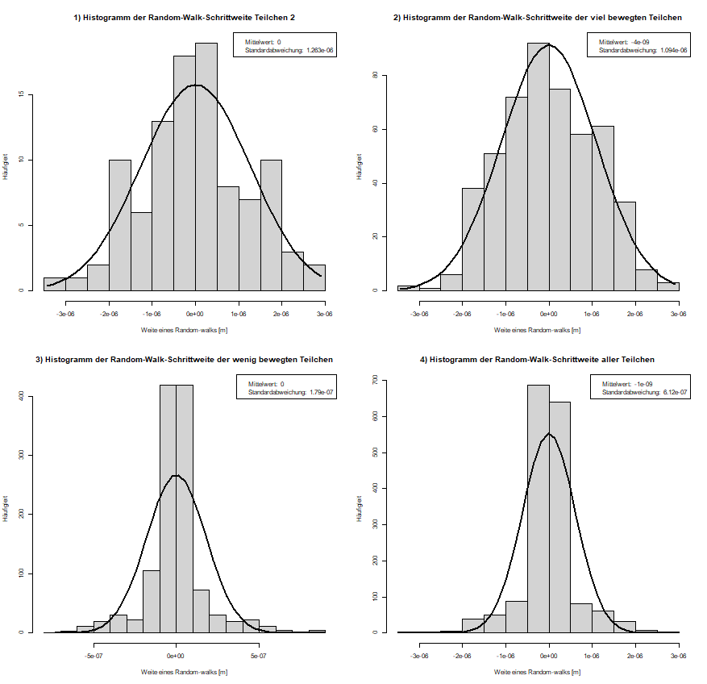

# Simulation

# Experiment

## Thema

Bestimmung dere Diffusionskonstanten eines Polystyrolpartikels, sowie die Berechnung der Boltzmann- und Avogadrokonstanten.

## Material

\begin{itemize}
\item{Mikropartikel (Polystyrol) Suspension in Wasser}
\item{Lichtmikroskop mit Objektträger}
\item{Deckplättchen}
\item{Thermometer}
\item{Zur Messung und Auswertung wurden folgende Computerprogramme benutzt: ThorCam, Tracker, SciDAVis, Python, R.}
\end{itemize}

## Versuchsaufbau und Durchführung
{width=20%, height=20%}

Auf einen Objektträger wurde ein Tropfen einer Mikropartikel (Polystyrol) Suspension in Wasser gegeben. 
Zwei Deckplättchen wurden neben den Tropfen, und eines mittig auf die anderen beiden positioniert und unter das Mikroskop gelegt. 
Die Polystyrolpartikel (PSP) wurden scharf gestellt. 
Als Vergrößerung wurde 40/0.65 gewählt. 

## Durchführung

Mit Hilfe einer Mikroskopkamera und des Programms "ThorCam" wird die Projektion auf dem Bildschirm sichtbar.
Eine Zeitreihe über den Zeitraum von hundert Sekunden und im Umfang von 100 Bildern wurde von den PSP automatisch, mittels "ThorCam", erstellt.

Nach Aufnehmen der Messreihe wurde die Temperatur im Lichtgang des Mikroskopes für ca. 20 Sekunden gemessen. 
Diese betrug ca. 21,7°C.
Die Messunsicherheit liegt bei $U_{Temperatur}=\frac{0,1^{\circ}C}{2\sqrt{6}}= 0,020^{\circ}C$
Danach wurde mit Hilfe des Programms "Tracker" die Position des Teilchens ausgewertet. 
Dafür wird in einem Datensatz von 100 Bildern das "Teilchen of interest" mit dem Cursor markiert.

Nachdem sich die Verarbeitung der Daten als kompliziert herausgestellt hatte, wurde abweichend von erster Methode eine zweite Auswertung des Bildmaterials vorgenommen.
Diese bestand darin, mittels eines Programmes die Mittelpunkte aller 17 PSP in allen 100 Einzelbildern zu bestimmen.
Das Ergebnis dieser Methode war eine große csv-Datei mit den Koordinaten aller PSP-Mittelpunkte im Zeitlichen verlauf.
Es wurde darauf verzichtet, diese hier abzudrucken, weil diese erstens zu groß ist, zweitens keinen informativen Mehrwert bietet und drittens eine grafische Auswertung der Ergebnisse in den nächsten Abschnitten vorgenommen wird.

## Fehlerbetrachtung

Eine Unsicherheit der Methodik besteht in der Umrechnung der Bildpunkte in Meter.
Eine zweite Unsicherheit besteht in der Auflösung des Bildes.
Eine dritte Unsicherheit besteht in dem verwendeten Programm. 
Letztere Unsicherheit wird aber als kleiner eingeschätzt, als die manuelle Auswertung.
Grund dafür ist, dass die Lage des Mittelpunktes für jeden PSP in jedem Bild aus der Gesamtheit aller, zu dem entsprechenden PSP gehörigen, Pixel berechnet wurde, anstatt dies per Hand zu machen.

## Beobachtungen

Zu Beginn werden die zurückglegten Wege aller PSP im Bildausschnitt geplottet.
Ein einzelner, ausgewählter Partikel (NR. 2) wird exemplarisch genauer dargestellt, indem dessen Bewegungspfad einzeln in einem höheren Maßstab geplottet wird.

{width=20%, height=20%}

Auf Abbildung 2 ist erkennbar, dass die 17 beobachteten PSP sich in ihren zurückgelegten Wegen deutlich unterscheiden.
Während 12 PSP sich praktisch nicht von ihrer Ausgangsposition bewegt haben, ist bei sechs Teilchen eine deutliche Abweichung zwischen Anfangs- und Endposition auszumachen.
Es ist nicht verwunderlich, dass viele Partikel keinen räumlichen Versatz aufweisen.
Netto sollte die Bewegung aller Randomwalks zusammengenommen zu einem Verharren jedes Teilchens an seinem Ursprung führen, Abweichungen durch die Standardabweichungen sind möglich.
Andere Erklärungen, wie die Ortsgebundenheit der PSP als Folge von adhäsiven Kräften zwischen PSP und den Glasplättchen sind aber auch denkbar.
Zwar sind auch für die scheinbar unbewegten Teilchen Bewegungen bestimmt worden, diese sind aber mikroskopisch kaum nachweisbar und könnten ein Resultat der Unsicherheit beim verwendeten visuellen Messverfahren sein. 

Interpretationsspielraum geben die zurückgelegten Pfade der fünf anderen Teilchen (T 1, 2, 4, 6, 10, siehe Abbildung 2).
Die Schrittweite dieser Teilchen war 2 Größenordnungen höher, als die der "wenig unbewegten" Teilchen.
Jene "viel bewegten Teilchen" weisen trotz aller Zufälligkeit der einzelnen Random-walks eine gewisse Tendenz zu einer Bewegung entgegen der y-Achse auf.
Hier stellt such die Frage, ob neben der diffusiven Bewegungskomponente auch eine advektive Transportkomponente einen Einfluss auf die Teilchenbewegung hat.
Ursache könnte eine kleine Strömung auf mikroskopischer Ebene zwischen den Glasplättchen sein, möglicherweise verursacht durch einen Temperaturgradienten aufgrund der erhöhten Temperatur des Wassers im Lichtgang des Mikroskopes.

### Umrechnung der Messwerte in Meter

Im nächsten Schritt können die ermittelten Werte für die Diffusionspfade von Pixel in Meter umgerechnet werden.
Hierbei ist der Maßstab der aufgenommenen Bilder vonnöten.
Dafür werden die PSP selbst verwendet, von denen bekannt ist, dass deren Durchmesser 2µm beträgt.
Beim Zählen der Pixel ist darauf geachtet worden, die Originalauflösung zu verwenden, in der auch die Berechnung der Schrittweiten berechnet wurde.

{width=21%, height=21%}

Aus dem Zusammenhang, dass sechzehn Bildpixel zwei Mikrometern entsprechen, folgt für die Kantenlänge eines Pixels eine Länge von $0,125 \mu m$. 
Die kleinste ablesbare Skala in dem Bild ist der Durchmesser von $2\mu m$ des PSP.
Für die Unsicherheit der Kantenlänge eines Pixels folgt so $u_{Pixellänge} = \frac{1}{16}\cdot \frac{2\mu m}{2\sqrt{6}} = 0,026\mu m$.
```{r}
# Berechnung der Kantenlänge eines Pixels
2*10**(-6)/16
# Berechnung Unsicherheit der Kantenlänge:
2*10**(-6)/(16*2*sqrt(6))
```

### Statistische Untersuchung

Nach dieser Umrechnung kann mit statistischen Mitteln versucht werden, weitere Aussagen über das Diffusionsverhalten der PSP zu treffen.
Zunächst werden hier alle 17 beobachteten Teilchen behandelt, einfach, weil es interessant ist.
Im weiteren Verlauf soll die Diffusionskonstante, die Boltzmannkonstante und die Avogadrokonstante aber nur anhand eines ausgewählten Teilchens erfolgen, Teilchen 2, siehe Abbildung 2.

Zunächst werden also die Random-walk-Schrittweiten (RWS) aller Teilchen beschrieben.
Die RWS eines Teilchens berechnet sich aus den Verschiebungskomponenten in x- und y-Richtung während eines Random-walkes und der anschließenden Berechnung des Betrages der resultierenden Bewegung.
Um zu unterscheiden, ob eine Bewegung vorwärts, oder rückwärts erfolgte wurde eine Konvention bezüglich des Vorzeichens der RWS getroffen: Dort, wo x- und y-Verschiebungskomponente vorzeichengleich sind wurde ein positives, andernfalls ein negatives Vorzeichen vergeben.
Dieses Vorgehen sollte für statistische Zwecke ausreichend sein.
Zur Veranschaulichung der Ergebnisse werden Histogramme verschiedener Gruppen von Teilchen, grob gegliedert nach der Gesamtverschiebung, die anhand von Abbildung 2 für jedes PSP ersichtlich ist, erstellt:

\begin{itemize}
\item Histogrammm 1: RWS von Teilchen 2
\item Histogrammm 2: RWS der "viel bewegten" Teilchen (Teilchen 1, 2, 4, 6, 10)
\item Histogrammm 3: RWS der "wenig bewegten" Teilchen (Teilchen 3, 5, 7, 8, 9, 11, 12, 13, 14, 15, 16, 17)
\item Histogrammm 4: RWS aller Teilchen
\end{itemize}

{width=31%, height=31%}

Die Histogramme sehen eigentlich alle ganz gut normalverteilt aus. 
Unterschiede in der Standardabweichung sind zwischen den wenig und den viel bewegten Teilchen erkennbar, bei letzteren ist die Standardabweichung um $0,45\mu m$ größer.
Die Mittelwerte aller Verteilungen liegen, wie erwartbar, allesamt praktisch bei Null.

## Auswertung

Für die Berechnung verschiedener Konstanten werden nun nicht mehr die Bewegungen aller Teilchen untersucht, sondern lediglich die des Teilchens 2, siehe Abbildung 2.

### Berechnung der Diffusionskonstante
Mittels der folgender Formel kann für jedes Teilchen die zugehörige Diffusionskonstante $D$ berechnet werden:
$$D=\frac{\sigma^2}{2t}$$
Mit:
\begin{itemize}
\item $\sigma$: Standardabweichung der Schrittweite eines Random-walks für ein PSP
\item $t$: Zeitintervall zwischen zwei Bildaufnahmen ($t=1s=const.$).
\end{itemize}

### Berechnung der Boltzmannkonstante

### Berechnung der Avogadrokonstante

## Interpretation
