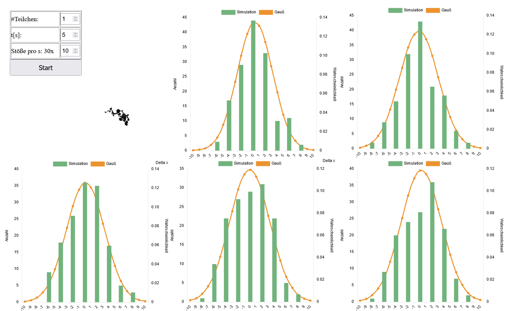
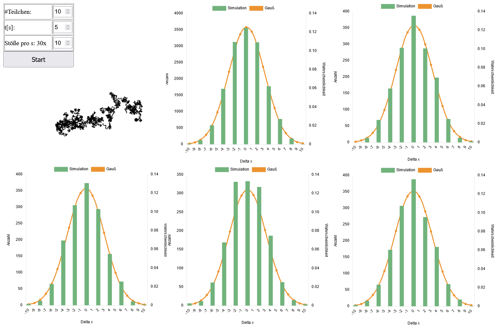
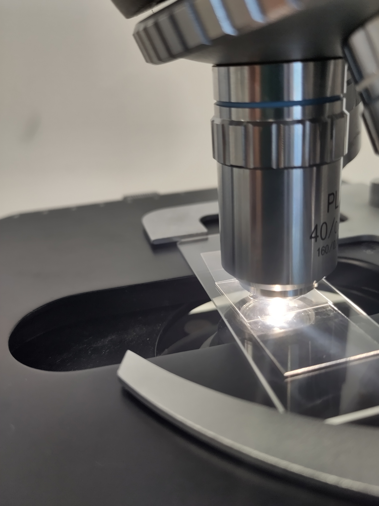
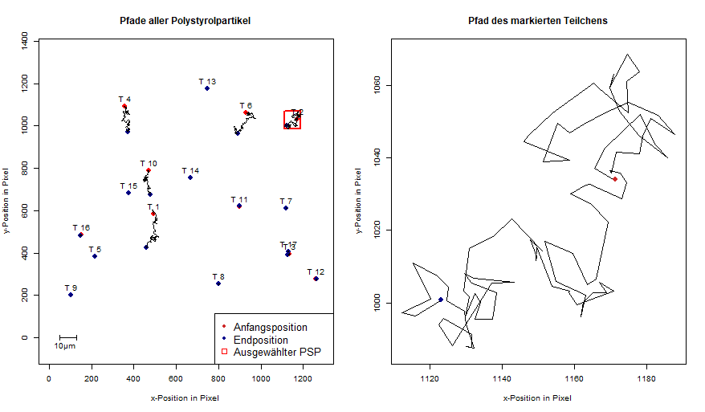
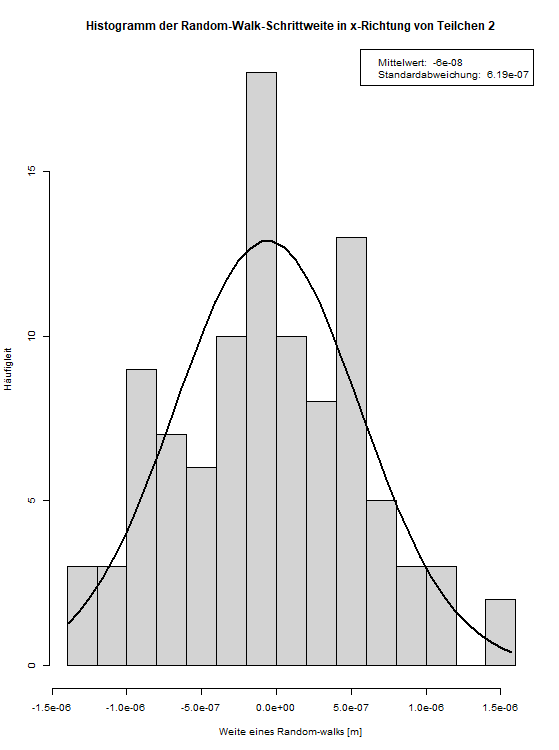

# Simulation

{width=10%, height=10%}

{width=10%, height=10%}

{width=10%, height=10%}

# Experiment

## Thema

Bestimmung dere Diffusionskonstanten eines Polystyrolpartikels, sowie die Berechnung der Boltzmann- und Avogadrokonstanten.

## Material

\begin{itemize}
\item{Mikropartikel (Polystyrol) Suspension in Wasser}
\item{Lichtmikroskop mit Objektträger}
\item{Deckplättchen}
\item{Thermometer}
\item{Zur Messung und Auswertung wurden folgende Computerprogramme benutzt: ThorCam, Tracker, SciDAVis, Python, R.}
\end{itemize}

## Versuchsaufbau und Durchführung
{width=20%, height=20%}

Auf einen Objektträger wurde ein Tropfen einer Mikropartikel (Polystyrol) Suspension in Wasser gegeben. 
Zwei Deckplättchen wurden neben den Tropfen, und eines mittig auf die anderen beiden positioniert und unter das Mikroskop gelegt. 
Die Polystyrolpartikel (PSP) wurden scharf gestellt. 
Als Vergrößerung wurde 40/0.65 gewählt. 

## Durchführung

Mit Hilfe einer Mikroskopkamera und des Programms "ThorCam" wird die Projektion auf dem Bildschirm sichtbar.
Eine Zeitreihe über den Zeitraum von hundert Sekunden und im Umfang von 100 Bildern wurde von den PSP automatisch, mittels "ThorCam", erstellt.
Über die Messunsicherheit der Länge der Zeitintervalle ist nichts bekannt.

Nach Aufnehmen der Messreihe wurde die Temperatur im Lichtgang des Mikroskopes für ca. 20 Sekunden gemessen. 
Diese betrug ca. 21,7°C.
Die Messunsicherheit liegt bei $u_{Temp}=\frac{0,1^{\circ}C}{2\sqrt{6}}= 0,020^{\circ}C$
Danach wurde mit Hilfe des Programms "Tracker" die Position des Teilchens ausgewertet. 
Dafür wird in einem Datensatz von 100 Bildern das "Teilchen of interest" mit dem Cursor markiert.

Neben dieser Methode wurde eine zweite Auswertung des Bildmaterials vorgenommen.
Diese bestand darin, mittels eines Pythonscripts (siehe Anhang) die Mittelpunkte aller 17 PSP in allen 100 Einzelbildern zu bestimmen.
Das Ergebnis dieses Verfahrens war eine große Datei mit den Koordinaten aller 17 PSP-Mittelpunkte in allen 100 Bildern.
Es wurde darauf verzichtet, diese hier abzudrucken, stattdessen werden die Ergebnisse in Abbildung 4 grafisch dargestellt.
Mit diesen Daten wird weitergearbeitet.

## Fehlerbetrachtung

Eine Unsicherheit der Methodik besteht in der Umrechnung der Bildpunkte in Meter.
Eine zweite Unsicherheit besteht in der Auflösung des Bildes.
Durch die Verwendete Methode konnte eine Manuelle Verfolgung der PSP umgangen werden.
Diese computervisuelle Methode sollte zu kleineren fehlern führen. 

## Beobachtungen

Zu Beginn werden die zurückglegten Wege aller PSP im Bildausschnitt geplottet.
Ein einzelner, ausgewählter Partikel (NR. 2) wird exemplarisch genauer dargestellt, indem dessen Bewegungspfad einzeln in einem höheren Maßstab geplottet wird.

{width=20%, height=20%}

Auf Abbildung 4 ist erkennbar, dass die 17 beobachteten PSP sich in ihren zurückgelegten Wegen deutlich unterscheiden.
Während 12 PSP sich praktisch nicht von ihrer Ausgangsposition bewegt haben, ist bei sechs Teilchen eine deutliche Abweichung zwischen Anfangs- und Endposition auszumachen.
Es ist nicht verwunderlich, dass viele Partikel keinen räumlichen Versatz aufweisen.
Netto sollte die Bewegung aller Randomwalks zusammengenommen zu einem Verharren jedes Teilchens an seinem Ursprung führen, Abweichungen durch die Standardabweichungen sind möglich.
Es ist aber auch möglich, dass diese Teilchen an den Glaspättchen kleben.
Zwar sind auch für die scheinbar unbewegten Teilchen Bewegungen bestimmt worden, diese sind aber mikroskopisch kaum nachweisbar und könnten ein Resultat der Unsicherheit beim verwendeten visuellen Auswertungsverfahren sein. 

Interpretationsspielraum geben die zurückgelegten Pfade der fünf anderen Teilchen (T 1, 2, 4, 6, 10, siehe Abbildung 4).
Jene "viel bewegten Teilchen" weisen trotz aller Zufälligkeit der einzelnen Random-walks eine gewisse Tendenz zu einer Bewegung entgegen der y-Achse auf.
Hier stellt sich die Frage, ob neben der diffusiven Bewegungskomponente auch eine advektive Transportkomponente einen Einfluss auf die Teilchenbewegung hatte.
Ursache könnte eine kleine Strömung auf mikroskopischer Ebene zwischen den Glasplättchen sein, möglicherweise verursacht durch einen Temperaturgradienten aufgrund der erhöhten Temperatur des Wassers im Lichtgang des Mikroskopes.

### Umrechnung der Messwerte in Meter

Im nächsten Schritt können die ermittelten Werte für die Diffusionspfade von Pixel in Meter umgerechnet werden.
Hierbei ist der Maßstab der aufgenommenen Bilder vonnöten.
Dafür werden die PSP selbst verwendet, von denen bekannt ist, dass deren Durchmesser 2µm beträgt.
Beim Zählen der Pixel ist darauf geachtet worden, die Originalauflösung zu verwenden, in der auch die Berechnung der Schrittweiten berechnet wurde.

{width=21%, height=21%}

Aus dem Zusammenhang, dass sechzehn Bildpixel zwei Mikrometern entsprechen, folgt für die Kantenlänge eines Pixels eine Länge von $0,125 \mu m$. 
Die kleinste ablesbare Skala in dem Bild ist der Durchmesser von $2\mu m$ des PSP.
Für die Unsicherheit der Kantenlänge eines Pixels folgt so $u_{Pixellänge} = \frac{1}{16}\cdot \frac{2\mu m}{2\sqrt{6}} = 0,026\mu m$.
```{r}
# Berechnung der Kantenlänge eines Pixels
2*10**(-6)/16
# Berechnung Unsicherheit der Kantenlänge:
2*10**(-6)/(16*2*sqrt(6))
```

### Statistische Untersuchung

Nach dieser Umrechnung kann mit statistischen Mitteln versucht werden, weitere Aussagen über das Diffusionsverhalten der PSP zu treffen.
Im weiteren Verlauf sollen dann die Diffusionskonstante, die Boltzmannkonstante und die Avogadrokonstante anhand eines ausgewählten Teilchens berechnet werden.

Zunächst wird also die Random-walk-Schrittweite (RWS) des ausgesuchten Teilchens 2 berechnet.
Die Berechnung findet nur in einer räumlichen Dimension, der x-Dimension, statt.
Die RWS wird berechnet, indem die x-Postition dew  Bildes $i$ von der x-Position des Bildes $i+1$ abgezogen wird.
Die Berechnung findet in R statt:

```{r}
# Einlesen der x-Positionen aller Teilchen aus dem erhobenen Datensatz
x_meter <- read.csv('code/Tabellen/x_meter.csv')

### Funktion zur Berechnung der RWS
calculateDistance1D = function(vector){
  shift_vector = c(0, vector[1:(length(vector)-1)])
  dist = vector-shift_vector
  dist[1] = 0
  return(dist)
}

# Berechnung der RWS von Teilchen 2
RWS <- calculateDistance1D(x_meter$X.2)
```

Die RWS von Teilchen 2 kann grafisch veranschaulicht werden.
Dies erfolgt mittels eines Histogramms, in dem die Häufigkeiten bestimmter RWS aufgetragen ist.

{width=31%, height=31%}

Das Histogramme sieht normalverteilt aus.
```{r}
shapiro.test(RWS)
```

Ein Shapiro-Wilk Test unter der Nullhypohese der Normalverteiltheit liefert einen p-Wert von $p = 0,7713$.
Die Mittelwerte der Bewegung beträgt $-6\cdot10^{-8}m$.
Dass dieser von Null abweicht, liegt entweder daran, dass das Teilchen nicht über einen hinreichend langen Zeitraum beobachtet wurde, oder daran, dass neben der Diffusion auch andere Bewegungskomponenten auf den PSP wirkten.
In Abbildung 4 ist ebenfalls ersichtlich, das Teilchen 2 insgesamt eine leichte Tendenz zu Bewegungen entgegen der x-Achse hatte.

## Auswertung

### Berechnung der Diffusionskonstante
Mittels der folgender Formel kann für Teilchen 2 die Diffusionskonstante $D$ berechnet werden:
$$D=\frac{\sigma^2}{2t}$$
Mit:
\begin{itemize}
\item $\sigma$: Standardabweichung der Schrittweite eines Random-walks für ein PSP
\item $t$: Zeitintervall zwischen zwei Bildaufnahmen ($t=1s=const.$).
\end{itemize}

Nun kann die Standardabweichung aus den Werten der RWS-Serie berechnet werden.
```{r}
# Standardabweichung x-Verschiebung von Teilchen 2
sigma = sd(RWS) #m
sigma
```
Der Fehler der Standardabweichung berechnet sich als Quotient aus Standardabweichung und der Anzahl von Messwerten ($n=100$).
```{r}
# Fehler der Standardabweichung
u_sigma = sd(RWS)/100 #m
u_sigma
```
Unter der Annahme, dass die Bewegung hinreichend lange beobachtet wurde beträgt die mittlere Verschiebung $\sigma$, bzw. Schrittweite $\delta$ bzw. Standardabweichung der Verschiebung $\Delta x$: $\sigma = (6.185 \pm 0.062 )\cdot 10^{-7}m = (0.6185 \pm 0.0062 )\mu m$.

Nun kann die Diffusionskonstante berechnet werden (in $\frac{m^2}{s}$):
```{r}
# Berechnung der Diffusionskonstanten für Teilchen 2
D = sd(RWS)^2/(2*1) #m^2/s
D
```

Auch die Unsicherheit der Diffusionskonstante kann berechnet werden.
Da über die Unsicherheit der vom Computer bestimmten Zeitintervalle nichts weiter bekannt ist wird $u_t$ als null angenommen.
$$u_D = \sqrt{(\frac{\partial D}{\partial \sigma}\cdot u_{\sigma})^2 + \frac{\partial D}{\partial t}\cdot u_{t})^2}= \sqrt{(\frac{2\sigma}{2t}\cdot u_{\sigma})^2+(\frac{\sigma^2}{2t^2}\cdot u_t)^2}$$
```{r}
# Berechnung der Unsicherheit der Diffusionskonstanten für Teilchen 2
u_D = sqrt( (2*sigma/2*u_sigma)**2 + (sigma**2/2*1**2*0)**2 ) #m^2/s
u_D
```
Damit wurde für Partikel 2 eine Diffusionskonstante von $D=(191.2 \pm 3.8)\cdot 10^{-15} \frac{m^2}{s}$ bestimmt.

### Berechnung der Boltzmannkonstante

Die Boltzmannkonstante soll über die Einstein-Smoluchowski-Gleichung berechnet werden:
$$DC = k_B\cdot T \Leftrightarrow k_B = \frac{DC}{T} \Leftrightarrow k_B = \frac{D\cdot 6\pi \eta r}{T}$$
Mit:
\begin{itemize}
  \item $k_B$: Boltzmannkonstante
  \item $D$: Diffusionskonstante $(0.6185 \pm 0.0062 )\frac{\mu m^2}{s}$
  \item $C$: Stokessche Reibungskonstante ($C=6\pi \eta r$)
  \item $T$: Temperatur $(21,700 \pm 0,020)^{\circ}C$
  \item $\eta$: danamische Viskosität von Wasser bei $20^{\circ}C$: $1002\cdot 10^{-6} \frac{kg}{ms}$
  \item $r$: Radius von PSP $2\mu m$
\end{itemize}

Die Berechnung der ermittelten Boltzmannkonstante ergibt, mit der Einheitenbetrachtung $[\frac{\frac{m^2}{s}*\frac{kg}{ms}*m}{K} = \frac{kg\cdot m^2}{K\cdot s^2}= \frac{J}{K}]$:
```{r}
eta = 1002e-6 # m^2/s
r = 1e-6 # m 
Temp = 21.7 + 273.15
kB = (D*6*pi*eta*r)/(Temp) #kg*m^2/(s^2*K)
kB
```
Die Unsicherheit der ermittelten Boltzmannkonstante $u_{kB}$ errechnet sich als:
$$u_{kB} = \sqrt{(\frac{\partial k_B}{\partial D}\cdot u_D)^2 + (\frac{\partial k_B}{\partial T}\cdot u_T)^2}$$
$$\sqrt{(\frac{6\pi \eta r}{T}\cdot u_D)^2+(\frac{D\cdot 6\pi \eta r}{T^2} \cdot u_T)^2}$$
```{r}
u_T = 0.020 # K
sqrt(((6*pi*eta*r)/(Temp)*u_D)**2+((D*6*pi*eta*r)/(Temp**2)*u_T)^2)
```
In diesem Versuch wurde also eine Boltzmannkonstante von $k_B = (1,225 \pm 0,025) \cdot 10^{-23} \frac{J}{K}$ bestimmt.

### Berechnung der Avogadrokonstante

Es gilt das allgemeine Gesetz:

\begin{equation*}
R=N_A*k_B \leftrightarrow N_A = \frac{R}{k_B}
\end{equation*}
\noindent $R$ = universelle Gaskonstante = $8,314 \frac{J}{mol\cdot K}$ \
\noindent $N_A$ = Avogadrokonstante \
\noindent $k_B$ = Boltzmannkonstante

Damit ergibt sich mit der zuvor ermittelten Boltzmannkonstante von $k_B = (1,225 \pm 0,025) \cdot 10^{-23} \frac{J}{K}$ ein Bestwert von:

\begin{equation*}
N_A = \frac{R}{k_B} = \frac{8,314 \frac{J}{mol\cdot K}}{1,225 \cdot 10^{-23} \frac{J}{K}} \approx 6.786939\cdot 10^{23} \frac{1}{mol}
\end{equation*}

Die Unsicherheit ergibt sich mit:

\begin{equation*}
u_{NA}= \frac {\partial N_A}{\partial k_B} \cdot u_{kB} 
= \vert - \frac{R}{k_B^2} \cdot u_{kB}\vert 
= \frac{8,314 \frac{J}{mol\cdot K}}{(1,225 \cdot 10^{-23} \frac{J}{K})^2} \cdot 0,025 \cdot 10^{-23} \frac{J}{K} \approx 0,14 \cdot 10^{23} \frac{1}{mol}
\end{equation*}

```{r}
8.314/(1.225*10**-23) #Bestwert Avogadrokonstante
8.314/((1.225*10**-23)**2)*0.025*10**-23 #Unsicherheit
```
Die Avogadrokonstante ergibt sich folglich mit $N_A = (6.79 \pm 0.14) \cdot 10^{23} \frac{1}{mol}$

## Interpretation

Obwohl sowohl der Literaturwert für die Boltzmannkonstante ($k_B = 1,380 \cdot 10^{-23} \frac{J}{K}$) als auch der Literaturwert der Avogadrokonstante ($N_A = 6,022 \cdot 10^{23} \frac{1}{mol}$) nicht in die von uns bestimmten Intervalle fallen, liegen beide ermittelten Werte in der richtigen Größenordnung und nahe am Literaturwert. Sie können daher als ganz gute Näherungen betrachtet werden.