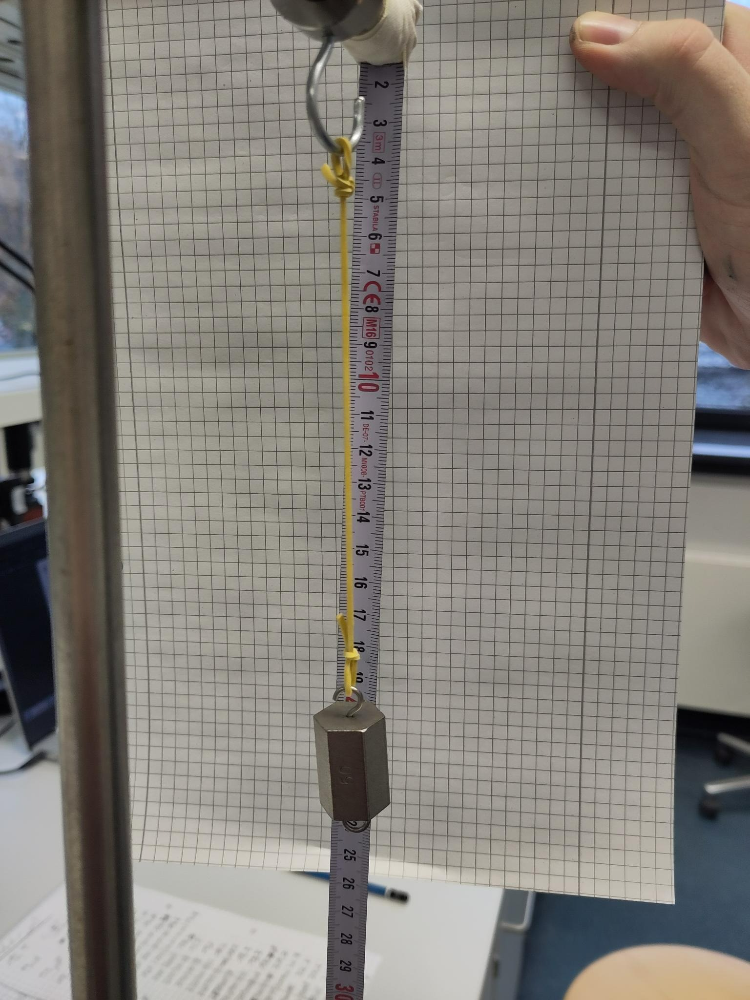

# Versuch 1

## Ziel

Überprüfung der Anwendbarkeit des Hookeschen Modells auf ein Gummiband durch Bestimmung der Federkonstante


## Materialien

* Stativ 
* Gummiband
* Gewichte
* Maßband
* Haken
* Klebeband 

## Versuchsaufbau

* Aufstellung des Stativs, Befestigung am Tisch
* Befestigung des Hakens am Stativ
* Befestigung des Maßbandes am Stativ mit Hilfe von Klebeband
* Aufhängung des Gummibandes am Haken
* In das Gummiband werden die Gewichte gehängt


## Durchführung

Die Gewichte werden gewogen und die Messunsicherheiten berechnet.
Die 10g und die 100g Gewichte lagen doppelt vor und waren jeweils gleich schwer.
Die Gewichte stellten sich generell als zu leicht heraus. 
Nur die zwei 10g Gewichte wogen nach einer Beschriftung mit Klebeband $10,0g$.
Gewichte:
```{r}
Gewichte <- read.csv("Daten/Gewichte.csv", 
                     col.names = c("Name", "Einzelmasse", 
                                   "n_Gewichte", "Sollwert", "Gewicht_g"),
                     sep=";", dec=",")
Gewichte[1:6,1:2]
```
Die Gesamtmasse $m_{ges}$ einer Gewichtskombination wird durch Addition der Teilmassen berechnet.

Die Geräteungenauigkeit berechnet sich zu: $u_{Gerät}= \sqrt{u_{Skala}^2+u_{Waage}^2}$ 
Dabei ist $u_{Skala}$ konstant bei $u_{Skala} = \frac{0,0001kg}{2\sqrt{3}}=2,9*10^{-5}kg$.
Für $u_{Waage}$ wurde eine Messunsicherheit von ... am Gerät abgelesen.
Damit errechnet sich eine Geräteungenauigkeit von $u_{Gerät}=$ ... .

Für die Unsicherheit der aus $n$ Gewichten kombinierten Masse M $u_{m}$ gilt, da für alle Messungen die gleiche Waage benutzt wurde, der Zusammenhang:
$$u_m = \sum\limits_{i=1}^{n}u_{m,i} = n*u_{Gerät}$$
```{r}
# Skalenunsicherheit
u_Skala = 1*10**(-4)/(2*sqrt(3)) #kg
# BAUSTELLE: Hier fehlt noch die Geräteungenauigkeit der Waage (Waagenunsicherheit)
u_Waage = 0.05*10**(-3) #Geschätzt in kg
# Geräteunsicherheit
u_Gerät = sqrt((u_Skala)^2+(u_Waage)^2)
# Massenunsicherheit

# Massenungenauigkeit
u_m = Gewichte$n_Gewichte*u_Gerät #kg
```

Zunächst wird die Länge des Gummibandes ohne zusätzliches Gewicht gemessen. 
Die Länge betrug 11,2 cm. Diese Länge muss später von allen Messwerten abgezogen werden, um nur die Auslenkung aus dem Nullzustand als Datensatz aufzunehmen.

Danach werden nacheinander verschiedene Gewichte an das Gummiband gehängt und die entsprechende Auslenkung gemessen. 
Diese wird an der Unterkante des Gummibandes, sobald dieses nach dem Anbringen der Gewichte nicht mehr schwingt, abgelesen.
Unsere Gruppe entschied sich zunächst dafür, eine Messreihe mit Intervallen von $5g$ durchzuführen. 
Nach den ersten 20 Messungen ($100g$) entschieden wir uns dafür, die Intervalle auf $10g$ zu erhöhen, da wir zunächst den Aufwand unterschätzten und Daten mit einem Abstand von 10g immer noch zur Beurteilung der Federkonstante ausreichen.

Die Auslenkung wird am Maßband abgelesen (Messskala in mm). Dies bedeutet eine Ungenauigket der Auslenkung von:
$$u_{x}=\frac{a}{2\sqrt{6}}= \frac{0,001m}{2\sqrt{6}}=2,0*10^{-4}m$$
```{r}
# Auslenkungsungenauigkeit 
u_x = 2.0*10**(-4) #m
```


## Fehlerquellen

Bei den Fehlerquellen ist zunächst der **personenbezogene Ablesefehler** zu erwähnen.
Diesen versuchten wir weitestgehend zu eliminieren, indem nur eine Person eine vollständige Datenreihe aufnahm.

Eine weitere Fehlerquelle kann die **Zeitabhängigkeit der Auslenkung** sein. 
Ein Gummiband kann nach einer gewissen Zeit mehr nachgeben, als bei der direkten Messung. 
Wir haben uns bemüht, die Messungen sehr direkt und ohne Verzug vorzunehmen. 
Die Zeitanghängigkeit haben wir jedoch nicht näher untersucht.

Besonders wichtig ist zu erwähnen, dass die Länge $x_0$ am Anfang und am Ende nicht übereinstimmten (11,2cm am Anfang zu 11,6cm am Ende). Dies ist auf die **konstante Dehnung des Gummibandes** zurückzuführen und wurde ebenfalls bei der Messung vernachlässigt.

Neben diesen Versuchsbezogenen Fehlerquellen sind Annahmen zu nennen, die das Hooksche Gesetz voraussetzt, die sich aber in der Realität unter Umständen anders darstellen.
Dabei sind zu nennen:

*	Vernachlässigung von Energieumwandlung (z.B.: durch Reibung, $W=F_s*s$)
*	Lineare Kraft-Auslenkungs-Beziehung (Speziell im Falle des Gummibandes nur eingeschränkt anwendbar)
*	Der Stoff soll dehnbar sein, die Elastizitätsgrenze darf jedoch nicht überschritten werden.
* Keine plastische Verformung der Feder während mehrerer Messungen.
* Gleiches Verhalten bei und Expansion und Relaxation der Feder

## Messung
Mittels Excel werden die Daten aufgenommen und als csv-Datei exportiert.
An dieser Stelle können die erhobenen Messwerte zum Zwecke der Interpretatuion aus dieser csv-Datei eingelesen und aufgeführt werden.

```{r}
Messreihe <- read.csv("Daten/Messreihe.csv", sep=";", dec = ",")

# Anbindung der bereits errechneten Unsicherheit der Masse
Messreihe <- cbind(Messreihe, u_m)

colnames(Messreihe) <- c("n_Gewichte", "Sollwert_g", "Gewicht_g", "Auslenkung1",  "Auslenkung2", "x_Haken", "x_0_Ende", "u_m")
Messreihe[,1:4]
```

## Interpretation

### Berechnung der Gewichts- und Zugkraft

Zur Interpretation der Messergebnisse wird die Auslenkung $x_i$ normiert, indem die Nullauslenkung, diese beträgt $11,2 cm$ auf dem Maßband, von den anderen Messwerten subtrahiert wird, siehe entsprechenden Messwert für ein Gewicht von $0g$.
Zudem werden die Einheiten in die SI-Einheite umgerechnet, um den Einheitenbezug korrekt zu halten.

Im Anschluss wird die Kraft $F_{G,i} = m_i * g$ in Newton berechnet, die für das Gewicht $m_i$ auf das Gummiband wirkt.
Die Erdbeschleunigung beträgt $9,81\frac{m}{s^2}$.
Im Folgenden wird, wenn die Unterscheidung zwischen Gewichts- und Zugkraft aufgrund der Betragsgleichheit im zu untersuchenden Ruhezustand unsinnig ist, von einer sematischen Unterscheidung von $F_G$ und $F_{Zug}$ abgesehen und stattdessen verallgemeinernd von der wirkenden Kraft $F$ gesprochen.
Neben der Kraft kann auch die Unsicherheit der Kraft berechnet werden.
Diese berechnet sich als:
\begin{equation}
\begin{split}
u_F &= \frac{\partial F}{\partial {m}}*u_m
    &= g*u_m
\end{split}
\end{equation}

Nach der Rechnung Anschluss wird ein Kraft-Auslenkung Schaubild erstellt.
```{r}
# Nullwerte(x_0 = 11,2cm) abziehen
Messreihe$Auslenkung1_x0 <- Messreihe$Auslenkung1 - 11.2

# Einheitenbezug
Messreihe$Gewicht_kg <- Messreihe$Gewicht_g/1000 #g -> kg
Messreihe$Auslenkung1_x0_m <-  Messreihe$Auslenkung1_x0/100 #cm -> m

# ERDBESCHLEUNIGUNG
g = 9.81 #m/s^2

# Berechnung von Kraft und u_Kraft
Messreihe$Kraft <- Messreihe$Gewicht_kg * g #N
Messreihe$u_Kraft <- g*u_m

# Plotten
library(ggplot2)
ggplot(Messreihe, aes(x = Auslenkung1_x0_m, y = Kraft, ymin = Kraft-u_Kraft, 
                      ymax = Kraft+u_Kraft)) + 
  geom_point(size=0.1) + 
  geom_errorbar(width = 0.001) + 
  geom_errorbar(width = 0.001) +
  xlab("Auslenkung x [m]") + ylab("Kraft F [N]")
```
Wird $F$ gegen $x_i$ aufgetragen, ergibt sich  optisch ab einer Auslenkung von $5cm$ ein etwa linearer Zusammenhang. 
Im Bereich zwischen einer Auslenkung von $0cm$ und $5cm$ kann das Ausdehnungsverhalten des Gummibandes unter einer Gewichtsbelastung nicht als linear und somit nicht durch eine Federkonstante beschrieben werden.

### Berechnung der Federkonstanten

Da die Gewichtskraft $F_G=m*g$ und die Zugkraft des Gummibandes $F_{Zug} = x * D$ im Ruhezustand im Gleichgewicht zueinander stehen, gilt folgende Formel:

$$F_G = m * g = D*x = F_{Zug}$$

Mit:

* $D$: Federkonstante
* $m$: Masse des Gewichtes,
* $x$: Auslenkung,
* $g$: Erdbeschleunigung ($9,81\frac{m}{s^2}$).

Daraus ergibt sich für die Federkonstante D:
$$D =\frac{m*g}{x}$$
Diese wird für jede Auslenkung $x_i$ berechnet.
```{r}
Messreihe$Federkonstante <- Messreihe$Gewicht_kg*g/Messreihe$Auslenkung1_x0_m
```

Bei der hier vorliegenden Typ-A Messunsicherheit für die Werte der Federkonstante, in dem soeben beschriebenen Intervall, wird nach GUM der Mittelwert und die Standardabweichung des Mittelwertes berechnet, um ein Messergebnis und dessen Unsicherheit zu erhalten.

* Mittelwert: $\overline{D} = \frac{1}{n}\sum \limits_{i=1}^nD_i$
* Standardabweichung: $\sigma_D = \sqrt{\frac{1}{n-1} \sum_{i=1}^n (D_i - \overline{D})^2}$
* Standardabweichung des Mittelwertes: $\sigma_{\overline{D}}=\frac{\sigma_D}{\sqrt{n}}$

In dem Kraft-Auslenkungsschaubild wird optische Weise ersichtlich, dass es erst ab einer Auslenkung von ca. $5cm$ sinnvoll ist von einer Federkonstanten zu sprechen.
Für die Berechnung der Federkonstanten haben wir uns daher entschieden, die Werte für $x<0,05m$ auszuschließen. 
Zugleich müssen wir dann allerdings feststellen, dass die errechnete Federkonstante nur im Intervall $x \in (0,05m,\ x_{max}]$ gilt.

```{r}
# Ausschließen der Werte der Federkonstante mit x<=0,05
D <- Messreihe$Federkonstante[Messreihe$Auslenkung1_x0_m>0.05]

# Ausgabe als Dataframe
data.frame(Statistische_Kenngröße=c("Mittelwert_MW", 
                                   "Standardabweichung_SD", 
                                   "SD_von_MW"),
          Werte=c(mean(D), sd(D), sd(D)/sqrt(length(D))))
```
Die bestimmte Federkonstante, für eine Auslenkung des Gummibandes im Bereich von $5,0$ bis $26.8cm$, beträgt also $D=(30,91\pm 0,17)\frac{N}{m}$

%# Plotten
%ggplot(subset(Messreihe, !is.na(Federkonstante)), 
%            aes(x = Auslenkung1_x0_m, y = Federkonstante, 
%                ymin = Federkonstante-u_Federkonstante, 
%                ymax = Federkonstante+u_Federkonstante)
%  ) + geom_point() + geom_errorbar(width = 0.005)
%

#### Fehlerrechnung Federkonstante
Die Unsicherheit der Federkonstanten $u_D$ ergibt sich gemäß der Gaussschen-Fehlerfortpflanzung aus folgender Formel:

\begin{equation}
\begin{split}
u_D &= \sqrt{(\frac{\partial{D}}{\partial{m}}*u_m)^2+(\frac{\partial{D}}{\partial{x}}*u_x)^2}\\
u_D &=\sqrt{(\frac{g}{x}*u_m)^2+(-\frac{m*g}{x^2}*u_x)^2}\\
\end{split}
\end{equation}

Berechnung in R:
```{r}
# Funktion zur Berechnung der Messunsicherheit der Federkonstanten
# INPUT: x, m, u_m, u_x (glob)
# OUTPUT: u_D
u_D_funktion <- function(x,m, UM){
  sqrt(((g/x)*UM)**2+((-m*g/x**2)*u_x)**2)
}
 
Messreihe$u_Federkonstante <- u_D_funktion(x=Messreihe$Auslenkung1_x0_m, 
                                           m=Messreihe$Gewicht_kg,
                                           UM=Messreihe$u_m)
```

# Versuch 2

## Ziel

Untersuchung der Fragestellung, ob sich der Zusammenhang zwischen Kraft und Auslenkung verändert, wenn man die Angrifffskraft auf einen Strang des Gummibandes anstatt auf zwei verteilt.

Eine Hypothese ist, dass die Auslenkung bei gleicher Gewichtskraft doppelt so hoch ist, weil die Kraft auf nur einen Strang wirkt.


## Materialien 

* Stativ 
* Gummiband
* Gewichte
* Maßband
* Haken
* Klebeband
* Schere

## Versuchsaufbau

* Analog zu Versuch 1, aber das Gummiband wurde vorher mit einer Schere zerschnitten und durch geknotete Schlaufen an Haken und Gewicht befestigt.




## Durchführung

Analog zu Versuch 1. Wir haben uns dafür entschieden bis zur Marke von 100g in 5g - Intervallen und danach in 10g- Schriiten zu messen, um die Daten mit den Daten aus der ersten Versuchsreihe gut vergleichen können. Da das Band allerdings viel stärker durch das Anbringen von Gewicht gedehnt wurde, konnten wir ab 360g keine Messungewn mehr durchführen, da die Gewichte durch ihre Länge anfingen am Tisch aufzuliegen und so die Normalkraft die Gewichtskraft verfälscht hätte. Stattdessen haben wir den aus platztechnisch noch gut messbaren Wert für 400g genommen und den Rest der Tabelle nicht ausgefüllt.
$x_0$ lag bei uns in diesem Fall bei 15,8cm.

## Messung

## Auswertung

## Interpretation

