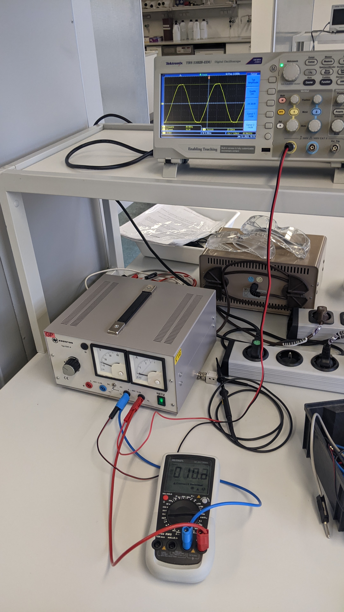

# 3.1 Gleichspannungsmessung

*Multimeter Anschlussarten erklären*

Eingestellte Spannung:
6,06 V (Voltmeter)


# 3.2 Wechselspannungsmessung

Das Multimeter wird in den Wechselspannungsmodus auf einen Messbereich von 200V eingestellt. Rückblickend betrachtet wäre es besser gewesen im Bereich von 20V zu messen. Die Unsicherheit wäre kleiner  gewesen. Über den COM-ANschluss wird das Multimeter mit dem negativen und dem positiven Pol des analogen Netzgerätes verbunden.

{width=20%, height=20%}

Die Spannung wird mit dem Multimetr auf $U_{eff} = 10,02 V$ (Voltmeter) eingestellt. Die Unsicherheit ergibt sich mit:

\begin{equation*}
\begin{split}
U_{Skala}&= \frac{a}{2\sqrt{3}} \\
U_{200V} &= \frac{0.1}{2\sqrt{3}} \approx 0,029V 
\end{split}
\end{equation*}

```{r}
0.1/(2*sqrt(3)) #Unsicherheit 200V
```
Im Folgenden wurde die zuvor eingestellte Spannung von $U_{eff} = (10,020\pm 0,029) V$  an das Oszilloskop angeschlossen und Spitze-Spitze Spannung $U_{SS}$ und Periodendauer $T$ graphisch ermittelt. 
Die ermittelten Werte lagen bei $U_{SS} = 28V$ und $T = 20ms$.
Die Unsicherheiten ergeben sich dabei mit:

\begin{equation*}
\begin{split}
U_{Skala} &= \frac{a}{2\sqrt{6}} \\
Spannung: U_{U_{SS}} &= \frac{1}{2\sqrt{6}} \approx 0,20V \\
Periodendauer: U_T &= \frac{1}{2\sqrt{6}} \approx 0,20ms 
\end{split}
\end{equation*}

```{r}
1/(2*sqrt(6)) #Unsicherheit Spannung und Periodendauer
```
Insgesamt liegen die rein graphisch ermittelten Werte also bei $U_{eff} = (28,00 \pm 0,20) V$ und $T = (20,02 \pm 0,20) mS$

Mit der Periodendauer $T = (20,02 \pm 0,20) mS$ ergibt sich eine Frequenz von:

\begin{equation*}
\begin{split}
f &= \frac{1}{T} \\
f &= \frac{1}{20ms} = 50 Hz \\
Unsicherheit: U_f &= \frac{1}{U_T} \\
U_f &= \frac{1}{0,20ms} = 5 Hz
\end{split}
\end{equation*}


```{r}
1/(20*10**-3) #Bestwert Frequenz
1/0.2 #Unsicherheit Frequenz
```

Der Wert von $f= (50 \pm 5) Hz$ entspricht der in Europa üblichen Frequenz des Stromnetzes von $50 Hz$.


