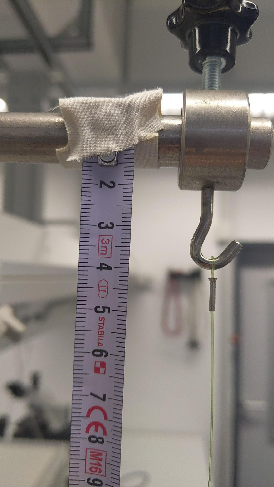
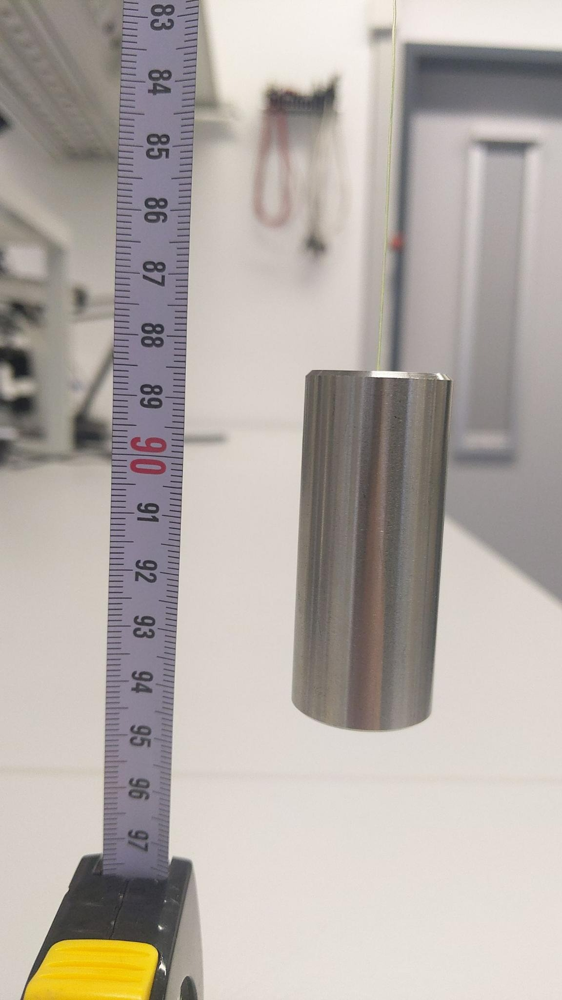

# Versuch 1 

## Ziel

Bestimmung der Erdbeschleunigung $g$. 

## Materialien
 
* Stativ
* Pendel aus Angelschnur und Metallzylinder
* Maßband
* Messschieber
* Klebeband
* Stoppuhr

## Versuchsaufbau

* Aufstellung des Stativs, Befestigung oberhalb des Tisches
* Befestigung des Maßbandes am Stativ mit Hilfe von Klebeband

{width=20%, height=20%}

## Durchführung

Zuerst wird die Länge des Pendels bestimmt. Dafür wird vereinfacht angenommen, dass der Massenmittelpunkt des zum Pendel gehörigen Zylinders in der Mitte liegt. Daher werden die Fadenlänge und die halbe Länge des Zylinders addiert. Der Faden wird mit dem Maßband (kleinste Ableseskala 1mm) und der Zylinder mit einem Messschieber (kleinste ABleseskala 0,1mm) gemessen.

{width=20%, height=20%}
\
\

{width=20%, height=20%}
\
\

Es werden insgesamt 5 Messungen mit insgesamt 10 Periodendurchläufen durchgeführt. Die Zeit wird zum Zeitpunkt der maximalen Geschwindigkeit sowohl gestartet als auch gestoppt, um die Reaktionszeit möglichst kurz zu halten.

## Fehlerquellen

Beim Auslenken des Pendels gibt es **unregelmäßige Bewegungen (Wackeln)**, die entgegen der Pendelbahn laufen. 

Beim Abmessen der Pendellänge ist der **personenbezogene Ablesefehler** zu erwähnen. Diesen versuchten wir weitestgehend zu eliminieren, indem nur eine Person eine vollständige Datenreihe aufnahm.

Außerdem verlängert die **Reaktionszeit** sowohl bei Start als auch bei Stopp der Messung tendenziell die gemessene Periodendauer. Um diesen Fehler möglichst gering zu halten, wurden meherere Periodendurchläufe (10) gemessen und die Periodendauer danach gemittelt. Auch hier nahm nur eine Person die Datenreihe auf, um die Reaktionszeit ähnlich zu halten.

Folgende Annahmen mussten darüber hinaus getroffen werden:

* Bewegung des Pendelkörpers und des Fadens verläuft reibungsfrei 
* Masse des Fadens wird vernachlässigt
* Der Pendelkörper wird nur um eine kleine Strecke ausgelenkt


## Messungen
```{r}
Werte <- read.csv("Daten/Daten.csv", sep = ";", dec = ",")
colnames(Werte) <- c("A","M1","M2","M3","M4","M5","M6","M7")
Werte <- Werte[,1:8]
```


## Auswertung

## Interpretation

# Versuch 2

Der zweite Versuch läuft analog zum ersten Versuch. Allerdings werden statt nur einer Messreihe 5 verschiedene - jeweils mit einer anderen Fadenlänge - gemessen. Um die Pendellängen zu variieren wurde der Faden für kürzere Fadenlängen mit Klebeband am Zylinder stückchenweise festgeklebt. Für längere Pendellängen wurden weitere Stücke Angelschnur an das Pendel geknotet. 

## Fehlerquellen
Die Fehlerquellen sind ebenfalls die selben wie beim ersten Versuch. Allerdings ist hierbei zu bemerken, dass die Reaktioszeit bei kürzeren Fadenlängen und daraus resultierenden kürzeren Periodendauern verhältnismäßig zunimmt. Auch von der Bahn abweichende Bewegungen nehmen bei kürzeren Pendellängen zu. 
Auch ist nicht unterscuht, wie sich Klebeband bzw. Knoten im Faden auf das Pendelverhalten auswirken.

## Messungen


Die Pendellänge wurde bestimmt, indem das obere und das untere Ende des Fadens am Maßband  abgelesen und die Differenz berechnet wurde. 
Es wurde auch darauf geachtet, die Distanz von der Pendeloberkante bis zum Massenschwerpunkt des Pendels dazuzurechnen. 
Dazu wurde die Massenverteilung in dem Metallzylinder-Gewicht als homogen angenommen und die Höhe des Zylinders mit dem Messschieber ausgemessen. 
Die zu der Fadenlänge zu addierende Länge entspricht dannn der halben Zylinderhöhe.  
Die Unsicherheit der Pendellänge setzt sich aus den zu diesen Messungen zugehörigen Messunsicherheiten zusammen:
\begin{align}
u_L &= \sqrt{u_{Maßband}^2+u_{Maßband}^2+u_{Zylinderhöhe}^2}\\
    &= \sqrt{2 \cdot u_{Maßband}^2+u_{Zylinderhöhe}^2}\\
    &= \sqrt{2 \cdot (\frac{10^{-3}m}{2\sqrt{6}})^2+(\frac{10^{-4}m}{2\sqrt{6}})^2}\\
    &= \sqrt{2,9*10^{-4}m}\\
\end{align}