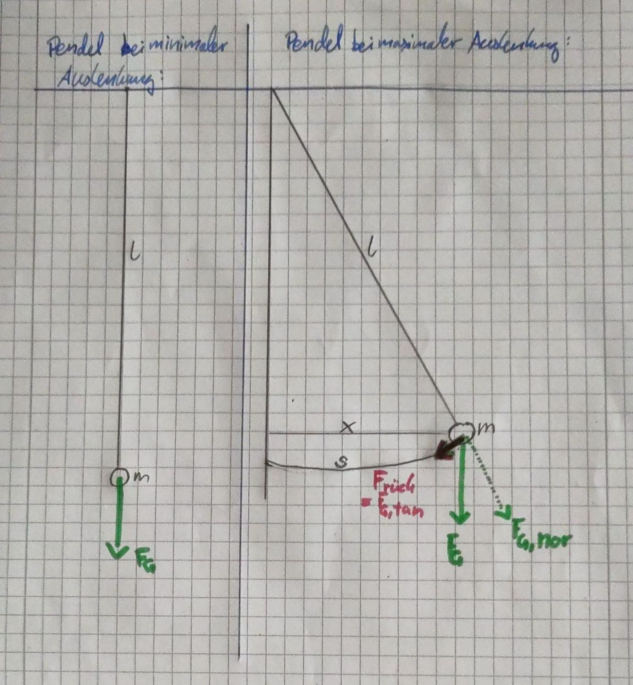

```{r setup, include=FALSE, echo=FALSE} 
knitr::opts_chunk$set(warning = FALSE, message = FALSE) 
```

# Versuch 1 

## Ziel

Bestimmung der Erdbeschleunigung $g$. Dafür soll ein Pendel verwendet werden. Es wird der Zusammenhang der Schwingungsdauer (Periodendauer) $T$ mit der Pendellänge $L$ und der Erdbeschleunigung $g$ verwendet. Es gilt:
$$T(L,g) = 2\pi \sqrt{\frac{L}{g}}$$
In diesem Versuch soll $L$ bekannt sein und $g$ untersucht werden.

{width=40%, height=40%}

Der genannte Zusammenhang ergibt sich aus der Eigenschaft eines Fadenpendels nach einer kleinen Auslenkung $x$ harmonisch zu schwingen. Die der Auslenkung entgegenwirkende Kraft, die Rückstellkraft $F_{Rück}$, ist proportional und entgegengesetzt zu $x$. 
Sie ist die resultierende Kraft aus der Gewichtskraft des Massenstücks am Pendel (der Faden wird als masselos angenommen) und der Zentripetalkraft (Zugkraft, durch den Faden in Richtung des Rotations-/Befestigungspunktes).
Mit einer Kleinwinkelannäherung gilt für $F_{Rück}$ folgender Zusammenhang:
\begin{equation}\label{Pendel:Rueck}
F_{Rück} = m * \ddot{x} = -\frac{g}{l}*m*x
\end{equation}
Werden neben der Luftreibung auch andere, dem System "Fadenpendel" Energie entnehmende Effekte vernachlässigt, handelt es sich bei dem Pendel und der nun periodisch stattfindenden Umwandlung von potentieller Energie, am Punkte der Maximalauslenkung, in kinetische Energie, am Punkt der maximalen Geschwindigkeit, um einen harmonischen Oszillator.
Die Auslenkung $x$ aus Formel 1 \label{Pendel:Ruek} ist dabei zeitabhängig und kann wie alle harmonischen Schwingungen duch Amplitude $\hat{x}$ und Winkelgeschwindigkeit $\omega$ beschrieben werden:
\begin{equation}\label{Pendel:Schwingung}
  x(t,\omega) = \hat{x} \cdot cos(\omega \cdot t)
\end{equation}
Die Winkelgeschwindigkeit ist dabei abhängig von Erdbeschleunigung und Pendellänge, vergleiche Formel \ref{Pendel:Rueck}, sie beträgt $\omega=\sqrt{\frac{g}{l}}$.
Über diese Winkelgeschwindigkeit kann mit dem Zusammenhang $T=2\pi\omega$ die Periodendauer für einen Pendelschlag bestimmt werden als:
\begin{equation}\label{Pendel:Periodendauer}
T(L) = 2\pi \sqrt{\frac{L}{g}}
\end{equation}


## Materialien
 
* Stativ
* Pendel aus Angelschnur und Metallzylinder
* Maßband
* Messschieber
* Klebeband
* Stoppuhr
* Berechnungen finden in Excel und R statt

## Versuchsaufbau

* Aufstellung des Stativs, Befestigung oberhalb des Tisches
* Befestigung des Maßbandes am Stativ mit Hilfe von Klebeband

{width=30%, height=30%}

## Durchführung

Nach dem Versuchsaufbau wird mit der Versuchsdurchführung begonnen.
Dazu wird die Pendellänge vermessen, indem am Maßband die Position des Drehpunktes (L1) und die Position der Oberkante des Zylindergewichtes abgelesen werden (L2).
Die Höhe des Zylindergewichtes wird mit einem Messschieber vermessen (L3).

Im Anschluss wird die Periodendauer für diese Pendellänge bestimmt.
Dazu wird das Pendel aus der Ruheposition ausgelenkt und nach ein paar Pendelschlägen mit der Zeitmessung begonnen.
Die Zeit wird beim Durchgang durch den Ort der maximalen Geschwindigkeit sowohl gestartet als auch gestoppt, um die Reaktionszeit möglichst kurz zu halten. 
Es werden insgesamt 5 Messungen durchgeführt um einen Mittelwert bilden zu können. 

## Fehlerquellen

Beim Auslenken des Pendels gibt es **unregelmäßige Bewegungen (Wackeln)**, die entgegen der Pendelbahn laufen. 

Beim Abmessen der Pendellänge ist der **personenbezogene Ablesefehler** zu erwähnen. 
Diesen versuchten wir weitestgehend zu eliminieren, indem nur eine Person eine vollständige Datenreihe aufnahm.

Außerdem verlängert die **Reaktionszeit** sowohl bei Start als auch bei Stopp der Messung tendenziell die gemessene Periodendauer. 
Um diesen Fehler möglichst gering zu halten, wurden zehn Periodendurchläufe gemessen und die Periodendauer danach gemittelt. 
Auch hier nahm nur eine Person die Datenreihe auf, um die Reaktionszeit ähnlich zu halten.

Folgende Annahmen mussten darüber hinaus getroffen werden:

* Bewegung des Pendelkörpers und des Fadens verläuft reibungsfrei 
* Masse des Fadens wird vernachlässigt
* Der Pendelkörper wird nur um eine kleine Strecke ausgelenkt
* Die Angelschnur ist inelastisch

## Messungen

Im Laufe von Versuch 1 wurden folgende Messwerte aufgenommen, auf die sich in der folgenden Auswertung bezogen wird: 
```{r, echo = FALSE}
Werte <- data.frame(read.csv("Daten/Daten.csv", sep = ";", dec = ",", header=FALSE))
colnames(Werte) <- c("Namen","M1","M2","M3","M4","M5","M6","M7")
Werte <- Werte[c(1,2,3,5:9),2]
# Ausgabe der Messwerte:
knitr::kable(data.frame(Messgröße = c("L1: Position Drehpunkt [cm]", "L2: Position Fadenende [cm]", "L3: Höhe Zylinder [cm]",
                                      rep("10-Periodendauer [s]", 5)),
                        Wert = Werte), 
             caption = "Messwerte aus Versuch 1")
```

Die fünf Punkte "10-Periodendauer [s]" sind die fünfmal durchgeführten Messungen, aus denen der Mittelwert berechnet werden soll.

## Auswertung

### Pendellänge L und Unsicherheit $u_L$

Die Pendellänge $L$ wird bestimmt, indem die Differenz von $L_1$ und $L_2$ berechnet wird, siehe Tabelle im Abschnitt \textit{Messungen}. 
Es wird auch darauf geachtet, die Distanz von der Pendeloberkante bis zum Massenschwerpunkt des Pendels dazuzurechnen.
Dafür wird die Massenverteilung in dem Metallzylinder-Gewicht als homogen angenommen. 
Die zu der Fadenlänge zu addierende Länge entspricht dann der halben Zylinderhöhe $L_3$.
Der Bestwert der errechneten Pendellänge $L$ beträgt dann:

\begin{align*}
L&= L_2-L_1+\frac{L_{3}}{2}\\
 &=0,885m-0,04m+\frac{0,0587}{2}m\\
 &=0,87435m.\\
\end{align*}

```{r}
# Bestwert Pendellänge in Metern
0.885-0.04+0.0587/2
```

Die Unsicherheit der Pendellänge setzt sich aus den zu $L_1$, $L_2$ und $L_3$ gehörigen Messunsicherheiten zusammen:
\begin{equation}\label{Pendel:U_L}
\begin{split}
u_L&= \sqrt{(\frac{\partial L}{\partial L_2} \cdot u_{Massband})^2+(\frac{\partial L}{\partial L_1} \cdot u_{Massband})^2+(\frac{\partial L}{\partial L_{3}} \cdot u_{Messchieber})^2}\\
&= \sqrt{u_{Massband}^2*(\frac{\partial L}{\partial L_2}^2+\frac{\partial L}{\partial L_1}^2)+(\frac{\partial L}{\partial L_{3}}*u_{Messschieber})^2}\\
&=\sqrt{(\frac{10^{-3}m}{2\sqrt{6}})^2*(1^2+(-1)^2)+(0,5*\frac{10^{-4}m}{2\sqrt{6}})^2}\\
&\approx 0,29 \cdot 10^{-4}m\\
\end{split}
\end{equation}

Mit:
\begin{itemize}
  \item Messunsicherheit des Maßbandes: $u_{Massband}=\frac{10^{-3}m}{2\sqrt{6}}$
  \item Messunsicherheit des Messschiebers: $u_{Messschieber}=\frac{10^{-4}m}{2\sqrt{6}}$
\end{itemize}
```{r}
# Berechnung von u_L in R
sqrt(2*(((10**-3)/(2*sqrt(6)))**2)+((10**-4)/(2*sqrt(6)))**2)
```
Damit beträgt die Pendellänge für Versuch 1 $L = (0,87435 \pm 0.00029)m$.


### Periodendauer T und Unsicherheit $u_T$

Als Zeit für zehn Perioden $T_{10T}$ in Sekunden wird der Mittelwert der fünf Messungen aus der Tabelle im Abschnitt \textit{Messungen} berechnet.
```{r}
T_10T <- mean(Werte[4:8])
T_10T
```

Die mittlere Periodendauer $T$ in Sekunden wird bestimmt, indem $T_{10T}$ durch die Anzahl von Perioden $n=10$ geteilt wird.

$$T_{10T} = n*T \Leftrightarrow T = \frac{18,778s}{10}=1.8778s$$

Die Messunsicherheit der digitalen Stoppuhr $u_{Stoppuhr}$ ist die Unsicherheit für $T_{10T}$. 
Deren kleinste ablesbare Größenordnung sind Millisekunden. 
Damit folgt für $u_{10T}$: $u_{10T}= \frac{a}{2\sqrt{3}} = \frac{0,01s}{2\sqrt{3}} \approx 0,0029s$.

Die Unsicherheit der Periodendauer $u_T$ ist für zehn Perioden dann ein Zehntel der Messunsicherheit für zehn Perioden, also $u_T=0.00029s$.

Damit ergibt sich die Periodendauer als:
$T=(1.87780 \pm 0.00029)s$.


### Berechnung der Erdbeschläunugung g und der Unsicherheit $u_g$

Mit den Bestwerten für die Pendellänge $L$ und die Periodendauer $T$ kann der Bestwert der Erdbeschleunigung $g$ berechnet werden.
In Formel \ref{Pendel:Periodendauer} eingesetzt ergibt sich mit $L = 0,8744m$ und $T = 1,878s$:

\begin{equation*}
\begin{split}
g&=\frac{4*\pi^2*l}{T^2}\\
\Rightarrow &=\frac{4*\pi^2*0,87435m}{(1,8778s)^2}\\
 &= 9,789182 \frac{m}{s^2} 
\end{split}
\end{equation*}


```{r}
(4*pi**2*0.87435)/(1.8778**2)
```

Messunsicherheit $u_g$ der Erdbeschleunigung $g$:
\begin{equation*}
\begin{split}
u_g&=\sqrt{(\frac{\partial g}{\partial T}*u_T)^2+(\frac{\partial g}{\partial l}*u_l)^2}\\
   &=\sqrt{(\frac{-8*\pi^2*l}{T^3}*u_T)^2+(\frac{4*\pi^2}{T^2}*u_l)^2}\\
\Rightarrow &= \sqrt{(\frac{-8\pi^2*(0,87435m)}{(1,8778s)^3}*(0,00029s))^2+(\frac{4\pi^2}{(1,8778s)^2}*(0,00029m))^2}\\
u_g&\approx \pm 0,0044 \frac{m}{s^2}
\end{split}
\end{equation*}

```{r}
# Berechnung von u_g in R
sqrt(( (-8*pi**2*0.87435)/(1.8778)**3 *0.00029)**2+( (4*pi**2)/(1.8778)**2 *0.00029 )**2)
```

Damit haben wir in Versuch 1 eine Erdbeschleunigung von $g=(9,7891 \pm 0,0044)\frac{m}{s^2}$ gemessen.

## Interpretation

Der Literaturwert von $g=9,81\frac{m}{s^2}$ liegt damit nicht im Fehlerintervall. 
Eventuell kann in einem Versuch, bei dem die Pendellänge varriiert wird ein besseres Ergebnis erziehlt werden.

\newpage

# Versuch 2

Der zweite Versuch läuft analog zum ersten Versuch. Allerdings werden statt nur einer Messreihe 5 verschiedene - jeweils mit einer anderen Fadenlänge - Messreihen aufgenommen. Um die Pendellängen zu variieren wurde der Faden für kürzere Fadenlängen mit Klebeband am Zylinder stückchenweise festgeklebt. Für längere Pendellängen wurden weitere Stücke Angelschnur an das Pendel geknotet. 

## Fehlerquellen

Die Fehlerquellen sind dieselben wie beim ersten Versuch. Allerdings ist hierbei zu bemerken, dass die Reaktioszeit bei kürzeren Fadenlängen und daraus resultierenden kürzeren Periodendauern verhältnismäßig zunimmt. Auch von der Bahn abweichende Bewegungen nehmen bei kürzeren Pendellängen zu. 
Zudem ist nicht untersucht, wie sich Klebeband bzw. Knoten im Faden auf das Pendelverhalten auswirken.

## Messungen

In die zu diesem Versuch gehörigen Werte wurden auch die Messwerte aus Versuch 1 integriert. 
Es wurde wieder so verfahren, dass pro Pendellänge fünf Messungen der Zeit für 10 Perioden gemessen und der Mittelwert berechnet wurde.

Die Messwerte sind die folgenden:

```{r, echo=FALSE}
# csv-Datei einlesen
Werte <- read.csv('Daten/Daten.csv', sep=";", dec=",", header=FALSE)
# Spaltennamen umbenennen
colnames(Werte) <- c("Messwert", paste("Versuch", 1:7))
# Zeilennamen umbenennen
rownames(Werte) <- c("L1:Oberes_Ende_in_cm",
                    "L2:UnteresEnde_in_cm",
                    "L3:Zylinderhoehe_in_cm",
                    "Pendellaenge_L",
                    paste("Zeit_fuer_10-Perioden_", 1:5),
                    "10-Perioden_Mittelwert")
#Ausgabe
Werte[2:ncol(Werte)]

# Transponieren der Werte für die Analyse
WerteT <- as.data.frame(t(Werte[,-1]))
```

## Auswertung

### Bereits aus Versuch 1 bekannte Größen

Damit sind die Werte für die Pendellänge sowie deren konstante Unsicherheit $u_L=0,00029m$, siehe Formel \ref{Pendel:U_L}, bekannt.
Ebenso sind die Werte für die Periodendauer $T$ bekannt, diese entsprechen einem Zehntel der Zeit für die gemessenen zehn Perioden.
Die Unsicherheit für T ist auch aus Versuch 1 übernehmbar, diese beträgt $u_T =  0,00029s$.

### Graphische Darstellung der Messwerte

Zur Veranschaulichung der Messwerte wird die Periodendauer $T$ gegen die Pendellänge aufgetragen:
```{r, echo=FALSE}
# Einbindung von benötigen Bibliotheken
library(tidyverse)

# Funktion zum einzeichnen der Fehlerbalken
errorbar <- function(x, ux, y, uy, headwidth=c(1,1)) {

  arrows(x0=x, x1=x, y0=y, y1=y+uy, 
         length=headwidth[1], angle=90)
  arrows(x0=x, x1=x, y0=y, y1=y-uy, 
         length=headwidth[1], angle=90)
  arrows(x0=x, x1=x+ux, y0=y, y1=y, 
         length=headwidth[2], angle=90)
  arrows(x0=x, x1=x-uy, y0=y, y1=y, 
         length=headwidth[2], angle=90)
}

# Eingabe von Unsicherheiten
u_T = 0.00029
u_L = 0.00029

# Selektion von  x- und y-Werten
x <- WerteT$Pendellaenge_L/100
y <- data.matrix(Werte[5:10,2:8], rownames.force = NA)/10

# Gruppierung der Daten
pltdf <- data.frame(x, t(y)) %>% gather(k, v,-x) %>% 
  mutate(MW = (k=="X10.Perioden_Mittelwert"))

# Plotten
{TFun <- function(x) 2*pi*sqrt(x/9.81)
TFuntxt <- expression("T(L)" == 2*pi*sqrt(frac("L", frac("9.81 m","s^2"))))
plot(x=pltdf$x, y=pltdf$v, 
     # Fenstergröße
     xlim=c(0, max(pltdf$x)),
     ylim=c(0, max(pltdf$v)),
     # Aesthetics
     pch=20, col="black",las=1,
     xlab="Pendellänge L [m]",
     ylab="Periodendauer T [s]")
errorbar(x=pltdf$x, ux=u_L, y=pltdf$v, uy=u_T, headwidth=c(1, 0.001))
curve(TFun(x), add=TRUE)
points(x=pltdf$x[pltdf$k=="X10.Perioden_Mittelwert"], 
       y=pltdf$v[pltdf$k=="X10.Perioden_Mittelwert"], 
       pch=17, col="red", cex=0.7)
legend("bottomright", 
       legend=c(TFuntxt, "Mittelwert", "Einzelwert"),
       col=c("black", "red", "black"), 
       pch=c(26, 17,20), lty=c(1,0,0), cex=0.8)}
```

In diesem Diagramm sind die Fehlerbalken nicht sichtbar, was an den kleinen Fehlern liegt.
Als Ersatz wurde zur Validierung der Messwerte die Funktion $T(L)=2\pi\sqrt{\frac{L}{g}}$ mit dem Literaturwert der Erdbeschleunigung für Berlin von $g\approx 9,81\frac{m}{s^2}$ eingezeichnet. 
Daran wird ersichtlich, dass die Messwerte alles in allem ganz gut sind.

### Linearisierung

Mittels einer Linearisierung erfolgt die Berechnung von $g$ für diesen Versuch.
Quadrierung von Formel \ref{Pendel:Periodendauer} ergibt: 
$$T^2 = 4\pi^2\frac{L}{g}$$
Daraus folgt eine Geradengleichung der Form $T^2(L)=:k(L)=a*L+y$ mit der Steigung $a=\frac{4\pi^2}{g}$ und dem y-Achsenabschnitt $y$.
Nach der Quadrierung der Messwerte für $T$ kann eine lineare Regression durchgeführt werden.
Eine Prüfung der Korellation liefert einen Korrelationskoeffizient von $0,9998$.
```{r}
# Berechnung der linearisierten Funktionswerte
xlin=WerteT$Pendellaenge_L/100 # in m
ylin=(WerteT$`10-Perioden_Mittelwert`/10)**2 # in s
# Korellationskoeffizient
cor(x=xlin, y=ylin, method='pearson')
```

Die lineare Regression erfolgt in R mittels QR-Faktorisierung in der lm()-Funktion.
```{r}
lm <- lm(ylin~xlin);lm
```
Im folgenden Schaubild ist die Funktionsgerade der linearen Regression zusehen.
Dabei ist die Steigung $a=\frac{4\pi^2}{g}=4,04209$ und der y-Achsenabschnitt $y=0,01952$.
Ebenfalls eingezeichnet sind die quadrierten Mittelwerte der Messwerte für die Periodendauer $T$ bei den untersuchten Pendellängen.

```{r, echo=FALSE, fig.height=3.5}
#Plotten
{par(mar=c(5,5,2,2))
plot(xlin, ylin, col="transparent", las=1,
     xlim=c(0, max(xlin)),
     ylim=c(0, max(ylin)),
     xlab="Pendellänge L [m]",
      ylab=expression(paste("Quadrierte Periodendauer T"^"2(L)", "[s"^"2","]")))
abline(coef=c(0.01952, 4.04209))
points(xlin, ylin, pch=17, col="red")
legend("bottomright", 
       legend=c(expression(paste("T"^2 == a*L+y )), "Mittelwert T"),
       col=c("black", "red"), 
       pch=c(26, 17), lty=c(1,0))}
```

### Berechnung der Erdbeschleunigung

Aus der Steigung $a$ kann die Erdbeschleunigung $g$ bestimmt werden:

\begin{align*}
a&= \frac{4\pi^2}{g}\\
\Rightarrow g &= \frac{4\pi^2}{4,04209}\\
 &= 9,766832901879 [\frac{m}{s^2}]\\
\end{align*}

### Berechnung von u_g

Bei der Berechnnung der Linearen Regression gibt die R funktion lm() folgenden output:
```{r}
summary(lm)
```

Mangels besseren Wissens nehmen wir den Standardfehler der Steigung $a$, wegen $g=4\pi^2/a$, als Unsicherheit für $g$.
Damit haben wir mit dem zweiten Versuchsansatz eine Erdbechleunigung von $g=(9,767 \pm 0,028)\frac{m}{s^2}$.

## Interpretation

Auch dieser Wert ist niedriger als der Literaturwert der Erdbeschleunigung für Deutschland mit $g\approx 9,81 \frac{m}{s^2}$. 
Trotz des im Vergleich zum ersten Versuchsansatzes größeren Fehlers, liegt der Literaturwert auch nicht im Fehlerintervall der bestimmten Erdbeschleunigung.

## Vergleich der Versuche

\begin{itemize} 
  \item Versuch: $g=(9,7891 \pm 0,0044)\frac{m}{s^2}$
  \item Versuch: $g=(9,767 \pm 0,024)\frac{m}{s^2}$
\end{itemize}

In Versuch 1 ist sowohl das präzisere, als auch das akkuratere Ergebnis erzielt worden, als in Versuch 2.
