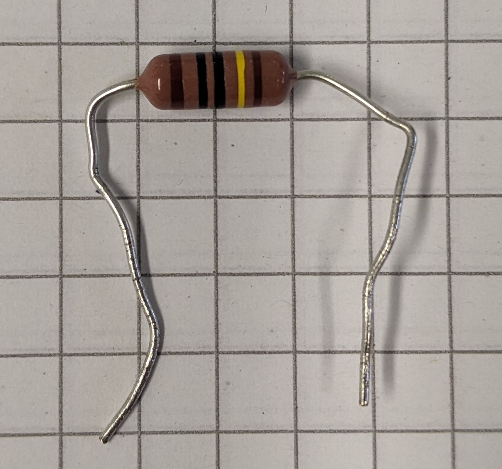
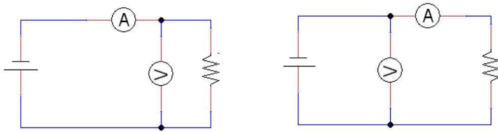
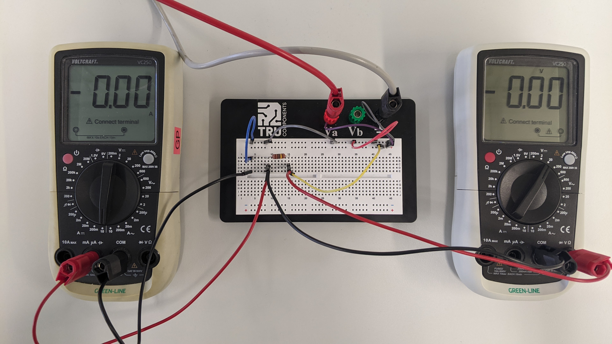
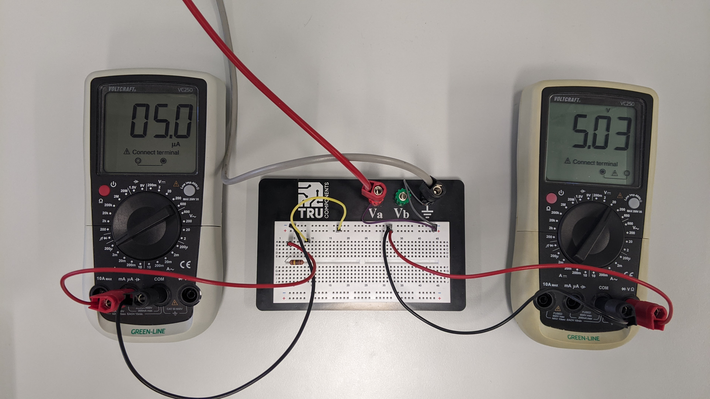
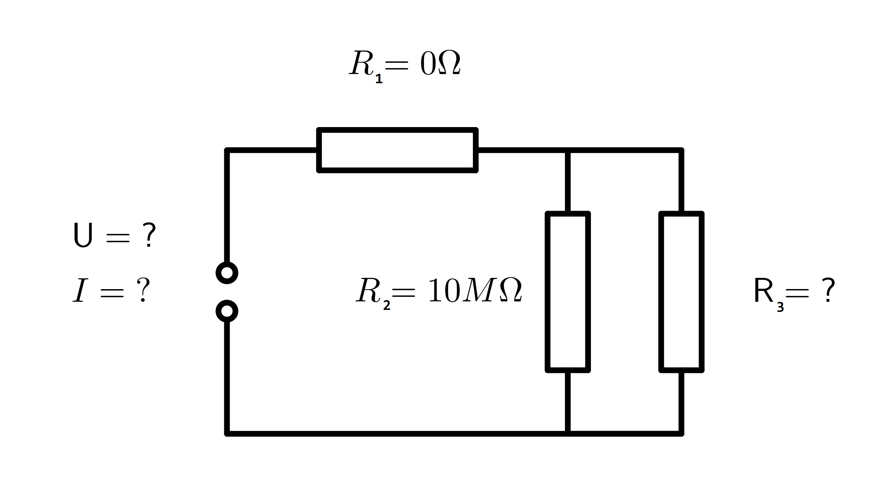

# Experiment

## Thema

Bestimmung von Widerständen auf direkte und indirekte Weise. 
Dazu werden die Beträge der zwei zu untersuchenden Widerstände durch ablesen der Farbcodes, durch Widerstandsmessungen mit einem Multimeter und in einem Schaltkreis ermittelt.

## Material

\begin{itemize}
\item{Zwei Multimeter}
\item{Breadboard}
\item{Jumperwire, Bananenstecker und Krokodilklemmen}
\item{Netzgerät}
\item{Zwei Widerstände unbekannter Größe}
\end{itemize}

## Auslesen der Widerstandsfarbcodes

Als erste Methode zur Bestimmung des Widerstandes werden die Bauteilspezifikationen auf dem Widertstand selbst abgelesen. Im folgenden wird von "Widerstand 1" und "Widerstand 2" gesprochen.

{width=20%, height=20%}

Die Farbreihenfolge auf dem Widerstand ist $Braun, Schwarz, Schwarz, Gelb, Braun$.
Dementsprechend kodiert der im Folgenden als $R_1$ bezeichnete Widerstand für $R_1 = (100 \cdot 10^4\pm 1\% ) \Omega \Leftrightarrow R_1=(1,00\pm 0,01) M\Omega$.

{width=20%, height=20%}

Widerstand 2 ist als Widerstand von $1\Omega$ gekennzeichnet. 
Aus Datenblättern im Internet geht hervor, dass auch dieser eine Toleranz von $\pm 1 \%$ aufweist (https://de.rs-online.com/web/p/durchsteckwiderstande/1249328).
Dies bedeutet einen Widerstand von $R_2=(1,00 \pm 0,01)\Omega$ für dieses Bauteil.

## Direkte Messung

Messungen der Widerstände mit dem Multimeter liefert Werte von:

\begin{itemize}
\item $R_1 = 1,005 M\Omega$\\
\item $R_2 = 1,0 \Omega$
\end{itemize}

### Messunsicherheiten der direkten Messung

Die Messunsicherheit der direkten Messung ergibt sich aus der Messunsicherheit der digitalen Skala:

\begin{equation*}
\begin{split}
u_{Skala} &=\frac{a}{2\sqrt{3}} \\
1.Widerstand: u_1 &= \frac{0,001M\Omega}{2\sqrt{3}} \approx \pm 0,00029 M\Omega \\
2.Widerstand: u_2 &= \frac{0,1\Omega}{2\sqrt{3}} \approx \pm 0,029\Omega 
\end{split}
\end{equation*}
```{r}
0.001/(2*sqrt(3)) #Unsicherheit 1
0.1/(2*sqrt(3)) #Unsicherheit 2
```

## Indirekte Widerstandsmessung

Die indirekte Bestimmung der Widerstände in einem Stromkreis erfolgt in zwei Varianten. Diese Unterscheiden sich in der Art des Schaltungsaufbaus. In Abbildung ... ist der Unterschied zwischen den Varianten a) und b) erkennlich.

{width=10%, height=10%}

In Variante a) wird das Voltmeter parallel zum Widerstand geschaltet, in Variante b) parallel zur Spannungsquelle.

Bei der Berechnung der Widerstände aus den gemessenen Werten werden zwei Annahmen/Vereinfachungen getroffen:
\begin{itemize}
  \item Durch das Voltmeter findet Stromfluss statt. Der tatsächliche Innenwiderstand beträgt ca. $10M\Omega$, wie Datenblättern des Messgerätes aus dem Internet entnommen und auch experimentell überprüft wurde.
  \item Das Amperemeter hat keinen Innenwiderstand. In den Datenblättern gab es keine Agaben zum Innenwiderstand des Amperemeters und auch experimentell konnte kein Widerstand bestimmt werden.
\end{itemize}

Verwendetes Datenblatt: https://asset.conrad.com/media10/add/160267/c1/-/en/000124501DS01/datasheet-124501-voltcraft-vc250-handheld-multimeter-digital-cat-iii-600-v-display-counts-2000.pdf.

## Aufbau (a)

Mithilfe der Kabel und des Breadboards wurde folgender Stromkreis aufgebaut:

{width=20%, height=20%}

Folgende Werte wurden gemessen:

\begin{itemize}
\item {Widerstand 1 (Messung bei 5,0V)}
\begin{itemize}
\item {Spannung: 5,04V}
\item {5,4 $\mu$A}
\end{itemize}
\item {Widerstand 2 (Messung bei 0,6V)}
\begin{itemize}
\item {Spannung: 0,15 V}
\item {150,3 mA}
\end{itemize}
\end{itemize}

### Gerätespezifische Messunsicherheiten

Die Messunsicherheitem von Spannung und Strom ergeben sich aus der Messunsicherheit der digitalen Skala

\begin{equation*}
\begin{split}
u_{Skala} &=\frac{a}{2\sqrt{3}} \\
\underline{1.Widerstand:} \\
Spannung: u_{U1a} &= \frac{0,01V}{2\sqrt{3}} \approx 0,0029 V \\
Strom: u_{I1a} &= \frac{0,1\mu A}{2\sqrt{3}} \approx 0,029\mu A \\
\underline{2.Widerstand:} \\
Spannung: u_{U2a} &= \frac{0,01V}{2\sqrt{3}} \approx 0,0029 V \\
Strom: u_{I2a} &= \frac{0,1mA}{2\sqrt{3}} \approx 0,029 mA \\
\end{split}
\end{equation*}
```{r}
0.01/(2*sqrt(3)) #Unsicherheit Spannung 1,2
0.1/(2*sqrt(3)) #Unsicherheit Strom 1,2
```
Folglich liegen die gemessenen Größen bei:

\begin{itemize}
\item $U1a = (5,0400 \pm 0,0029)V$
\item $I1a = (5,400 \pm 0,029) \mu A$
\item $U2a = (0,1500 \pm 0,0029)V$
\item $I2a = (150,300 \pm 0,029) mA$
\end{itemize}

### Berechnung der Widerstände

Es gilt das Ohmsche Gesetz:

$U=I\cdot R \Leftrightarrow R = \frac{U}{I}$

\noindent $R$ =Widerstand \
\noindent $U$ = Spannung \
\noindent $I$ = Strom


Für die Widerstände ergeben sich somit für Aufbau (a) Bestwerte von:
\begin{equation*}
\begin{split}
1. Widerstand: R=\frac{U}{I} = \frac {5,0400V}{5,4 \mu A} \approx 933333,3 \Omega \\
2.Widerstand: R=\frac{U}{I} = \frac {0,1500V}{150,3 mA} \approx 0,998004 \Omega \\
\end{split}
\end{equation*}

```{r}
(5.04/(5.4*10**-6)) #Widerstand 1
(0.15/(150.3*10**-3)) #Widerstand 2
```

### Messunsicherheiten

Die Messunsicherheit für die indirekt bestimmten Widerstände ergibt sich mit folgender Formel:

\begin {equation*}
\begin{split}
u_R &= \sqrt{\left (\frac{\partial R}{\partial U} \cdot u_U\right )^2 + \left (\frac{\partial R}{\partial I} \cdot u_I\right )^2 } \\
u_R &= \sqrt{\left (\frac{1}{I} \cdot u_U\right )^2 + \left (\frac{-U}{I^2} \cdot u_I\right )^2 } \\
1.Widerstand: u_{R1a}&= \sqrt{\left (\frac{1}{5,4\mu A} \cdot 0,0029V\right )^2 + \left (\frac{-5,04V}{5,4\mu A^2} \cdot 0,029 \mu A\right )^2 } \approx \pm 5000\Omega \\
2.Widerstand: u_{R2a}&= \sqrt{\left (\frac{1}{150,300mA} \cdot 0,0029V \right )^2 + \left (\frac{0,1500V}{150,300mA^2} \cdot 0,029mA\right )^2 } \approx \pm 0,019 \Omega
\end{split}
\end{equation*}

```{r}
# Unsicherheit Widerstand 1
sqrt(((1/(5.4*10**-6))*0.0029)**2+(5.04/((5.4*10**-6)**2)*0.029*10**-6)**2)
# Unsicherheit Widerstand 2
sqrt(((1/(150.3*10**-3))*0.0029)**2+(0.15/((150.3*10**-3)**2)*0.029*10**-3)**2)
```
Die Widerstände für den Aufbau (a) ergeben sich somit insgesamt zu:


\begin{itemize}
\item $R1a = (933300 \pm 5000)\Omega = (0,9333 \pm 0,0050)M\Omega$
\item $R2a = (0,998 \pm 0,019) \Omega$
\end{itemize}

Die Widerstände liegen in den richtigen Größenordnungen.
Die bestimmten Widerstände lassen sich im Rahmen ihrer Unsicherheiten nicht mit den Sollwerten von $10M\Omega$ und $1\Omega$, wie sie im Vorfeld bestimmt wurden vereinbaren.
Grund für die falschen Messergebnisse können z.B. die zum Voltmeter und dem Amperemeter getroffenen Annahmen sein.

## Aufbau (b)

Anschließend wurde der Schaltkreis, Versuchsvariante b) entsprechend, umgebaut:

{width=20%, height=20%}

Folgende Werte wurden gemessen:

\begin{itemize}
\item {Widerstand 1 (Messung bei 5,0V)}
\begin{itemize}
\item {Spannung: 5,03V}
\item {Strom: 5,0 $\mu$A}
\end{itemize}
\item {Widerstand 2 (Messung bei 0,8V)}
\begin{itemize}
\item {Spannung: 0,4 V}
\item {Strom: 101,8 mA}
\end{itemize}
\end{itemize}

### Gerätespezifische Messunsicherheiten

Die Messunsicherheiten von Spannung und Strom sind identisch zu denen im Aufbau (a).
Folglich liegen die gemessenen Größen bei:

\begin{itemize}
\item $U1b = (5,0300 \pm 0,0029)V$
\item $I1b = (5,000 \pm 0,029) \mu A$
\item $U2b = (0,4000 \pm 0,0029)V$
\item $I2b = (101,800 \pm 0,029) mA$
\end{itemize}

### Berechnung der Widerstände

Es gilt das Ohmsche Gesetz:

$U=I\cdot R \Leftrightarrow R = \frac{U}{I}$

\noindent $R$ =Widerstand \
\noindent $U$ = Spannung \
\noindent $I$ = Strom


Für die Widerstände ergeben sich somit für Aufbau (b) Bestwerte von:
\begin{equation*}
\begin{split}
1. Widerstand: R&=\frac{U}{I} = \frac {5,0300V}{5,000 \mu A} \approx 1006000 \Omega \\
2.Widerstand: R&=\frac{U}{I} = \frac {0,4000V}{101,800 mA} \approx 3,929273 \Omega \\
\end{split}
\end{equation*}

```{r}
(5.03/(5*10**-6)) #Widerstand 1
(0.4/(101.8*10**-3)) #Widerstand 2
```

### Messunsicherheiten

Die Messunsicherheit für die indirekt bestimmten Widerstände ergibt sich mit folgender Formel:

\begin {equation*}
\begin{split}
u_R &= \sqrt{\left (\frac{\partial R}{\partial U} \cdot u_U\right )^2 + \left (\frac{\partial R}{\partial I} \cdot u_I\right )^2 } \\
u_R &= \sqrt{\left (\frac{1}{I} \cdot u_U\right )^2 + \left (\frac{-U}{I^2} \cdot u_I\right )^2 } \\
1.Widerstand: u_{R1b}&= \sqrt{\left (\frac{1}{5,000\mu A} \cdot 0,0029V\right )^2 + \left (\frac{-5,0300V}{5,000\mu A^2} \cdot 0,029 \mu A\right )^2 } \approx \pm 5900\Omega \\
2.Widerstand: u_{R2b}&= \sqrt{\left (\frac{1}{101,800mA} \cdot 0,0029V \right )^2 + \left (\frac{0,4000V}{101,800mA^2} \cdot 0,029mA\right )^2 } \approx \pm 0,029\Omega
\end{split}
\end{equation*}

```{r}
# Unsicherheit Widerstand 1
sqrt(((1/(5*10**-6))*0.0029)**2+(5.03/((5*10**-6)**2)*0.029*10**-6)**2)
# Unsicherheit Widerstand 2
sqrt(((1/(101.8*10**-3))*0.0029)**2+(0.4/((101.8*10**-3)**2)*0.029*10**-3)**2)
```
Die Widerstände für den Aufbau (b) ergeben sich somit insgesamt zu:


\begin{itemize}
\item $R1b = (1006000\pm 5900)\Omega $
\item $R2b = (3,929\pm 0,029) \Omega$
\end{itemize}

Die Widerstände liegen in den richtigen Größenordnungen.
Die bestimmten Widerstände lassen sich im Rahmen ihrer Unsicherheiten nicht mit den Sollwerten von $10M\Omega$ und $1\Omega$, wie sie im Vorfeld bestimmt wurden vereinbaren. 
Besonders für Widerstand 2 ist im Experiment ein etwa vier mal höherer Wert bestimmt worden.
Grund für die falschen Messergebnisse können z.B. die zum Voltmeter und dem Amperemeter getroffenen Annahmen sein.

# Modellbildungsprozess

Bei unserem Versuch handelt es sich um ein Testexperiment, bei dem wir auf der Grundlage des Ohmschen Gesetzes Widerstände indirekt messen.
Es soll nun ein Modell erstellt werden, anhand dessen die Widerstände der elektrischen Widerstandsbauteile in den jeweiligen Schaltungen vorhergesagt werden können.

Die Modelle sollen den Schaltungen nachempfundene Widerstandsschaltungen sein, in denen Amperemeter und Voltmeter durch Widerstände ersetzt werden.

## Annahmen
Sowohl für Schaltung a), als auch für Schaltung b) wird grundsätzlich angenommen, dass das Voltmeter dabei einen Widerstand von $10M\Omega$ und das Amperemeter einen Innenwiderstand von $0\Omega$ hat (vergleiche Ausführungen dazu bei der indirekten Widerstandsmessung).
Eine weitere Annahme ist, dass der schaltungsdraht keinen Widerstand hat.

## Modell für Schaltung a)

{width=20%, height=20%}

***Input:***

Systemparameter:

* Spannung U an der Spannungsquelle
* Stromstärke I im gesamten Stromkreis

Randbedingungen:

* Widerstand Amperemeter $R_1$: $0\Omega$
* Widerstand Voltmeter $R_2$: $10M\Omega$

***Output:***

* Widerstand des unbekannten Widerstandes $R_3$

***Modelldomäne***
Innerhalb des Modells wird der Widerstand R_3 mittels folgender Formel berechnet:

$$(\frac{1}{(R_{ges}-R_1)}-\frac{1}{R_2})**-1$$

Diese Rührt von den bekannten Gesetzen zu dem Widerstand in Reihen- und Parallelschaltung, sowie dem Ohmschen Gesetz her.

\newpage
***Implementierung als R-Funktion mit zwei Argumenten:***
```{r}
# ---- Schaltung 1
# INPUT: Spannung, Stromstärke
# OUTPUT: Benötigter Widerstand
schaltung1 <- function(U0, I0){
  # Randbedingungen
  R1 = 0 # Widerstand Amperemeter
  R2 = 10e6 # Widerstand Voltmeter
  # Berechnung des Gesamtwiderstandes
  Rges = U0/I0
  # Berechnung des benötigten R
  R3 = (1/(Rges-R1)-1/R2)**-1
  print("Widerstände in der Schaltung in Ohm:")
  print(paste("R1: ", R1))
  print(paste("R2: ", R2))
  print(paste("R3: ", R3))
  print(paste("R_ges: ", Rges))
}
```

Wird das Modell mit den gemessenen Werten ausgeführt (das gemessene U und I entsprechen bei Schaltung a) den Einstellungen an der Spannungsquelle) erhält man mit diesem Modell folgenden Output:
```{r}
# Testen mit gemessenen Werten für Widerstand 1
schaltung1(U0=5, I0=5.4e-06)
```

```{r}
# Testen mit gemessenen Werten für Widerstand 1
schaltung1(U0=0.15, I0=0.1503)
```

